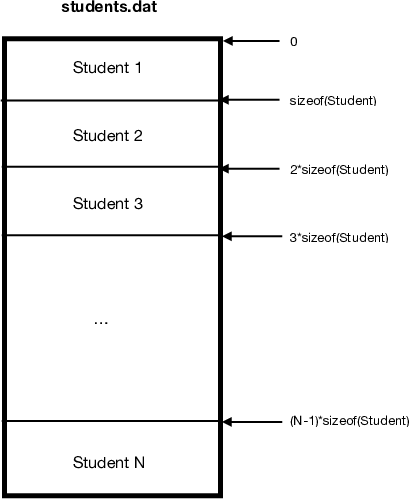

# Unit 3 - Files

In this unit we will learn to work with both text and binary files to perform basic operations: opening, reading, writing and closing. In addition we will discuss the main problems that we can find when working with files, and their solutions.

A file is a series of data on a storage device under a single identifying name and a path.

## Text files

Text files (also called **files with format**) are those that contain only printable characters. In ASCII code, they are the characters from code 32, which corresponds to the blank space: ' '. We can view the contents of text files using any text editor, unlike it happens with binary files.

Text files can be created with different character sets: ASCII (the default code for text files), EBCDIC, Unicode (in its most commonly used coding, UTF-8). A character set (also code character code) encodes each written symbol (letters, numbers, symbols, etc.) using a number. The file contents do not need to follow any format or special layout (you can not 'decorate' the text). In some cases they have special characters to indicate end of line (EOLN by _End Of line_) and to mark the end of file (EOF by *End of File*).

Examples of text files:

* A C++ source code file
* A webpage written in HTML
* A config file of an operating system (.ini in Windows, .conf in Unix)
* A README.txt file

### Reading example

This is an example code to read a file contents line by line. All the instructions needed (declaration, opening, reading and closing) are detailed in the next sections.

```cpp
#include <iostream>
#include <fstream>

using namespace std;

int main() 
{
      ifstream fi("myfile.txt"); // We declare a read-only file and open it from the disk
      if (fi.is_open()) // We check that the file could be opened
      {
            string s;
            while (getline(fi,s))  // Read line by line until the end of file is found
            {
                  cout << "Line read from file: " << s << endl;
            }
            fi.close(); // Close the file
      }
      else cout << "Error opening file" << endl; // An error should always be given if the file could not be opened
}
```

### Declaration

We must include the _fstream_ library to work with files:

```cpp
#include <fstream>
```

Then, we have several options to declare a variable for a file.

```cpp
ifstream readFile;  // If we only want to access the file for reading its contents
ofstream writeFile; // If we only want to access the file for writing on it
fstream readWriteFile; // If we want to perform both operations (reading and writing)
```

Take into account that is very unusual to need a text file that uses both modes simultaneously (reading and writing).

### Opening and closing operations

Once a file variable is declared it is necessary to open it (tell the filename on disk). The function ```open``` can be used for this task:

```cpp
bool open(const char[] filename, ios_base::openmode mode);  // Before C++11
bool open(const string &filename, ios_base::openmode mode); // Since C++11
```

For example:
```cpp
ifstream fi; // We declare a read-only file variable
fi.open("myfile.txt"); // We open the file called "myfile.txt" from the current path
```

Declaration and initialization can also be done in a single line:

```cpp
ifstream fi("myfilename.txt"); // We declare the variable and open it in read-only mode
```

Opening a file may yield some errors in runtime, for example when the file does not exist but it was opened for reading, or when the file is in a restricted path (we do not have permissions there) and is opened for writing. Therefore, after opening a file it is important to always check that this operation succeeded. This can be done with the function ```is_open()```:

```cpp
if (fi.is_open()) 
{
   // We can read from the file...
} 
else 
{
   // Opening error
}
```

Finally, once we are done with the file, we have to close it to free resources and allow other programs to work with that file. For this, we use the function ```close()```:

```cpp
fi.close();
```

### Opening modes

There are different modes that can be specified when opening the file, for example:

```cpp
// Declaration and initialization 
ifstream fi;
fi.open("myfilename.txt", ios::binary);
// Equivalent to:
ifstream fi("myfilename.txt, ios::binary);
```

The opening modes can be as follows:

| Mode | Description | Constant in C++ |
| -- | -- | -- |
| Reading | Only reading, starting from the beginning of the file (not necessary when using `ifstream`) | ```ios::in``` |
| Writing | Only writing, starting from the beginning of the file and overriting the file contents (not necessary when using `ofstream`) | ```ios::out``` |
| Reading and writing | Allows us to read and write contents to the file (not necessary when using `fstream`) | <code>ios::in &#124; ios::out</code> |
| Appending at the end of the file | Start writing from the end of the file without erasing its previous contents | <code>ios::app</code> |
| Move to the end of file | This option allows us to start reading or writing from the end of the file after opening it | ```ios::ate``` |
| Binary file | This mode allows us to use binary files. We will see this in detail in the binary files section | ```ios::binary``` |
| Truncate/erase contents | This mode allows us to erase all the contents of the file after opening it in write mode | ```ios::trunc``` |

### Reading text files

#### Detecting the end of file

When reading a file we need when we have reached the end of it to stop reading.

To know if we are at the end of a file after a reading operations, one possibility is to use the ```eof()``` method. For example, we could read the contents of a file through a loop that after each reading operation checks if the end of the file was reached:

```cpp
ifstream fi("myfile.txt");
if (fi.is_open())
{
      while(!fi.eof())
      {
            // Read file contents
      }
      fi.close();
}
else cout << "Error opening file" << endl;
```

This method returns a _Boolean_ value (*true* or *false*) depending on whether or not we are at the end. When we perform a reading operation (for example, with _cin_ or _getline_) of any data (character, integer, etc.) that cannot be done, ```eof``` returns *true*. But, **careful**, after having read **the last valid data** the method will still return *false*. Therefore, it is necessary to perform an additional reading (which result must be discarded, since it contains  invalid data) to cause the detection of the end of the file and make the ```eof``` function return *true*.

#### Reading line by line

There are alternative ways of reading a text file. For example, if wanted to read line by line:

```cpp
if (file.is_open()) 
{
   string s;
   getline(file,s);
   while (!file.eof()) 
   {
      // do something with s
      getline(file,s);
   }
   flie.close();
}
```

Note that we perform a reading operation before the while, and then we repeat the reading at the end of the loop. The following alternative is completely wrong:

```cpp
if (file.is_open()) 
{
   string s;
   while (!file.eof()) 
   {
      getline(file,s); // WRONG!
      // do something with s 
   }
   flie.close();
}
```

Why is it wrong? Consider for example that the file to be read is empty, or that we are in the last line of the file. With the second code, the end of file will be read first and we would process the string _s_, even if it is empty because ```getline``` could not read anything. In contrast, the first code deals correctly with this situation.

However, there is an alternative for reading a file which is easier and **recommended** when possible (in some situations it cannot be used). Here we do not need the ```eof()``` method because the function ```getline()``` already returns *false* when it cannot read anything else:

```cpp
if (file.is_open()) 
{
   string s;
   while (getline(file,s)) 
   {
      // do something with s
   }
   file.close();
}
```


#### Reading char, int, double, etc.

The following example shows how to read character by character. C++ files are objects of the class *stream*, therefore they can be accessed as input/output buffers using the ```>>``` and ```<<``` operators, in the same way what we do with *cin* and *cout* standard input / output buffers.

```cpp
if (file.is_open())
{
   char c; // This could also be int, float, etc.
   while (file >> c)
   {
      // do something with c
   }
   file.close();
}
```

In the following example we also read character by character, but considering that the file may contain blank spaces and we want to read them too (remember than blank spaces are ignored by the operator ```>>```):

```cpp
if (file.is_open())   
{
   char c;
   while (file.get(c)) 
   {
      // do something with c
   }
   file.close();
}
```

#### Reading with known mixed data types

Consider that we want to read the contents of a file that has several lines containing a string followed by two integers, for example:

```
hola 123 1024
mundo 43 23
```

To read a file like this we could use the following code:

```cpp
ifstream file("example.txt");

if (file.is_open())
{
   string s;
   int i,j;
   while (file >> s) // Read string
   {
      file >> i; // Read first number
      file >> j; // Read second number
      cout << "Read: " << s << "," << i << "," << j << endl;
   }
   file.close();
}
```

Alternative code (more compact):

```cpp
ifstream file("example.txt");

if (file.is_open())
{
   string s;
   int i,j;
   while (file >> s >> i >> j) // Read string, first number and second number
   {
      cout << "Read: " << s << "," << i << "," << j << endl;
   }
   file.close();
}
```

This is another example for a mixed-type contents (only a line with a number indicating the number of words, and then the words):

```
3 pedro antonio jordi
```

The code to read this file could be:

```cpp
if (file.is_open())
{
   string s;
   int n;
   file >> n;
   for(int i=0; i<n; i++) {
      file >> s;
      cout << "Name(" << i+1 << ")=" << s << endl;
   }
   file.close();
}
```

### Writing

To write in a text file we can use the output operator ```<<```, because as previously explained, files are *stream* objects and can be used as data input/output buffers.

```cpp
ofstream fo("results.txt"); // ofstream for writing

if (fo.is_open()) 
{
   const unsigned n = 10;
   for (unsigned i = 0; i < n; i++)
   {
         fo << "Printed: " << n << endl;
   }
   fo.close();
}
```

In this example, we simply open a file and write there "Printed: " and a variable called *n*. It must be taken into account that **the first writing operation erases all the previous contents of the file**. If we do not want to do so, we should use ```ios::app```.

Another writing example:

```cpp
ofstream fo("results.txt", ios::app); // ios::app means that the new contents will be appended at the end of the existing contents of the file
if (fo.is_open())
{
   fo << "Write something."
   fo << "Something else" << endl;

   fo.close();
}
```

### Exercises

#### Exercise 1

Make a program that reads a file called _myfile.txt_ and prints on screen only those lines containing the substring "Hello".

#### Exercise 2

Make a program for reading a file called _myfile.txt_, writing in another file _myfileUpper.txt_ the same content of the input file but with all the letters in uppercase. Example:

| myfile.txt | myfileUpper.txt |
| --- | --- |
| Hello, world. | HELLO, WORLD. |
| How are you? | HOW ARE YOU? |
| Bye and 1000 times bye | BYE AND 1000 TIMES BYE |

#### Exercise 3

Implement a program for reading two text files, _f1.txt_ and _f2.txt_, writing on the screen those lines that differ in both files. The program should print _<_ when the line corresponds to _f1.txt_, and _>_ when it corresponds to _f2.txt_. Example:

| f1.txt | f2.txt |
| --- | --- |
| Hello, world. | Hello, world. |
| My name is andrew | My name is Andrew |
| Bye, bye | See you soon |

El resultado debe ser:

```
Line 2:
< My name is andreu
> My name is Andreu
Line 3:
< Bye, bye
> See you soon
```

#### Exercise 4

Implement a function called _printLastLines_ which receives two arguments: the first one must be a positive integer _n_, and the second the name of a text file. The function must print on the screen the last _n_ lines of the given file. Example:

```cpp
printLastLines(3, "myfile.txt");
```

Assuming that the last three lines of the file are as follows, the output of the program should be:

```
with several worlds
one word
many, many, many words
```

This exercise can be solved in two possible ways: 
* Using "brute force": all the file could be read to count the number of lines, and then read it again to write the last _n_ lines. However, this is not efficient: what happens if the file had millions of lines?
* Using a vector of strings of size _n_ which stores at every time the last _n_ lines. At the beginning, it will contain less than _n_ lines.

#### Exercise 5

We have two text files _f1.txt_ and _f2.txt_ in which each line is a series of numbers separated by ':'. Assuming that the lines are in ascending order by the first number, make a function to read both files line by line, writing the common lines into the file _f3.txt_ like in the following example:

| f1.txt | f2.txt | f3.txt |
| -------- | -------- | -------- |
| 10:4543:23 | 10:334:110 | 10:4543:23:334:110 |
| 15:1:234:67 | 12:222:222 | 15:1:234:67:881:44 |
| 17:188:22 | 15:881:44 | 20:111:22:454:313 |
| 20:111:22 | 20:454:313 | |


## Binary files

A binary file stores a sequence of bytes. In this kind of files, data is stored as it is in the computer's memory. Unlike in text files, bytes are not converted into characters when they are saved into the file. For this reason, binary files are also called **files without format**. If we open a file using a standard text editor and we can see weird characters, then it is likely a binary file.

Examples of binary files:

* An image file
* A compiled program (executable file)
* A PDF file
* An MP3 file

Binary files are frequently used, for example, when a program deals with a vector of structs. One advantage is that whether in text files we need to start reading from the beginning of the file (what is called _secuential access_), in binary files we can access directly to the _n_-th element (struct) without reading the previous data (only if all structs have the same size). This is why binary files are said to have _direct (random)_ access.

For example, if we had a binary file called _students.dat_ which contains a vector of structs _Student_ and this struct has a constant size, we could access to any position of the file without reading the previous contents:



Another advantage of binary files over text files is that in some cases they store the information using less bytes. For example, if we wanted to store a vector of float numbers into a file, like:

```
124.1256 111.5123 7125512.1522123 25.151261
```

The size into a text file would be 44 bytes, one for each char. However, in a binary file, if the float type was 4 bytes, only 16 bytes would be needed as there are 4 numbers. In addition, when reading the text file the compiler should translate each sequence of chars (for example, "124.1256") into a number, but reading a binary file can be done without doing any type conversion, as data in a binary file is stored the same way than in the memory and therefore it could be copied directly. Moreover, we could access to the _n_-th number directly as we know the size of an integer.

### Reading example

### File reading example

This is an example code to read a file contents of a binary file sequentially. All the instructions needed (declaration, opening, reading and closing) will be detailed in the next sections.

```cpp
#include <iostream>
#include <fstream>

using namespace std;


struct Student
{
      char id[10];
      int group;
      float mark;
};

int main()
{
      ifstream fi("myfile.txt", ios::binary); // We declare a read-only binary file and open it from the disk
      if (fi.is_open()) // We check that the file could be opened
      {
           Student student;
           // Loop for reading all students from the binary file
           while (fi.read((char *)&student, sizeof(student))) 
           {
                  // Do something with ’student’
           }
           fi.close(); // Close the file
      }
      else cout << "Error opening file" << endl; // An error should always be given if the file could not be opened
}
```

### Declaration

Declaration is the same than with text files.

### Opening and closing

Here there is a difference, we need to add _ios::binary_ when opening the file:

```cpp
ifstream fi; // We declare a read-only file variable
fi.open("myfile.dat", ios::binary); // We open the binary file called "myfile.dat" from the current path
```

Declaration and initialization can also be done in a single line:

```cpp
ifstream fi("myfilename.dat", ios::binary); // We declare the binary file variable and open it in read-only mode
```

A binary file can also be opened for writing:

```cpp
ofstream fo("myfilename.dat", ios::binary);
```

And for reading and writing (which is more common in binary files than in text files):

```cpp
fstream fo("myfilename.dat", ios::binary);
```

Finally, to close a binary file, the method ```close``` is used as with text files.

```cpp
fi.close();
```

### Reading

For reading binary files we can **only** use the method ```read``` (instead of input operators or getline). This method receives two parameters:

* The variable (struct or other data type) where the data that was read should be stored.
* The amount of bytes to be read from the file. This size can be known using the function ```sizeof```. 

In the next example we read the contents of a binary file that contains a series of  structs of type *City*.

```cpp
struct City 
{
      char name[20];
      int population;
      int extension;
};

....

City city;
ifstream fb;

fb.open("myfile.dat", ios::binary);

if (fb.is_open())
{
   while (fb.read((char *)&city, sizeof(city)))
   {
      // Do something with ’city’
   }
   fb.close();
}
```

As we can see, with the while loop we read structs until the end of file is found. The first parameter of the function **read** is the variable where we want to store the data, and the second is the number of bytes that the program should read.

Note that:
* The first parameter also contains **(char *)&**. This is required to tell the compiler to read byte by byte, as a _char_ type always occupies one byte. 
* The second parameter is the size of the struct (in bytes) to be read, which can be calculated with **sizeof**. In this second parameter, instead of _city_ we could also have used _City_, as _sizeof_ returns the same value in both cases.

`IMPORTANT: To read the contents of a binary file we need to know in advance how was it written (the data type or struct that it contains). Also, as we need to know the size in bytes of the data to be read, it is mandatory that each data will have a constant size, or alternatively use a variable which tells us how many bytes the program should read.`

For this reason, we cannot store strings or vectors into a binary file. Well, actually we could with a trick that consists of reading a number that stores the length _n_ of the string or vector, and the read the string or vector afterwards by reading _n_ elements, but in Programming 2 we will only use char arrays in binary files.

### Direct access

As previously explained, if a binary file contains a series of elements of constant size, we can access directly to an element by calculating its position in function of the size of the data type.

For this, we can use the function ```seekg``` (meaning _seek get_) which receives two parameters:
* The position (in bytes) where we should start reading the file by moving the read pointer. This value could be negative in some cases, as we will see later.
* The reference from where should we start calculating the position, usually the beginning of the file. 

The second parameter could have the following values:

| Value | Example | Relative to |
| --- | --- | --- |
| ios::beg | fi.seekg(pos, ios::beg) | from the beginning of the file |
| ios::cur | fi.seekg(pos, ios::cur) | from the current position of the reading pointer |
| ios::end | fi.seekg(pos, ios::end) | from the end of the file |

For example, if we wanted to read the third struct from the file, we could use:

```cpp
if (fb.is_open()) {
	// We move the pointer just before the third element starting from the beginning:
	fb.seekg((3-1)*sizeof(city), ios::beg);
	fbl.read((char *)&city, sizeof(city));
}

``` 
In the following example we read the **last** element of the file:
```cpp

if (fbl.is_open()) {
	// we move the pointer just before the last element starting from the end:
	fbl.seekg((-1)*sizeof(city), ios::end);
	fbl.read((char *)&city, sizeof(city));
}

``` 

As you can see in this case, we use a negative position starting from the end of the file to move back the reading pointer ```sizeof(city)``` bytes.

### Writing 

In order to store data in a binary file we can use the method ```write```. Similarly to the ```read``` method, it receives two parameters: 

* The variable that contains the data to be written. 
* The number of bytes to be written. To calculate this, usually the function ```sizeof()``` is used. 

In the next sample code we write a struct of type *City* into a binary file called _myfile.dat_ :

```cpp
struct City 
{ 
      char name[20];
      int population;
      int extension;
};

...

City city;
ofstream fb("myfile.dat", ios::binary);

if (fb.is_open())
{
      // We enter data into the variable ’city’
      strcpy(city.name,"Alicante");
      city.population = 330525;
      city.extension = 201;

      // We write the variable city into the file
      fb.write((const char *)&city, sizeof(city));

      fb.close();
}
```

If we wanted to write into a given position of the file, we could use the function ```seekp```, which means _seek put_, to move the writing pointer. As you can see, the reading and writing pointer can have different values. The parameters of ```seekp``` are the same than those of ```seekg```:

* The position (in bytes) where we should start writing into the file by moving the writing pointer. This value could be negative in some cases. If this position did not exist because it is beyond the current size of the file, the file will be enlarged in order to perform the writing operation, leaving the intermediate bytes uninitialized.
* The reference from where should we start calculating the position, usually the beginning of the file.

For example, for writing the fifth element of a binary file containing a vector of structs of type _City_:

```cpp

if (fb.is_open()) 
{
	fb.seekp((5-1)*sizeof(city), ios::beg);
	fb.write((const char *)&city, sizeof(city));
}
``` 
In this case, if the file contains 5 or more structs, the program overwrites the fifth one with the contents of the variable _city_. However, if the file contained only 3 structs, it would be enlarged to allow writing into the fifth position, leaving  the bytes of the forth element uninitialized.

#### Converting strings into char arrays

If we wanted to store a struct containing a string into a binary file, we need to create another struct replacing the string by an array of characters and convert each variable from one struct into the another. When doing this conversion, it may happen that the string should be shortened to fit into the array. For example:

```cpp
struct City 
{
      char name[MAXLENGTH];
      int population;
      int extension;
};

string s="Alicante";
...
City city;
city.code = 3;
strncpy(city.name, s.c_str(), MAXLENGTH-1); // we convert the string into an array of characters
city.name[MAXLENGTH-1]='\0'; // As strncpy does not add the null character if the string is longer than the char array, we have to add it manually.
...
fb.write((const char *)&city, sizeof(city)); // We write the variable
...
```

#### Methods ```tellg()``` and ```tellp()```

These two methods allow us to get the current position (in bytes) of the reading or writing pointer, respectively.

* We use ```tellg()``` to get the reading pointer.
* We use ```tellp()``` to get the writing pointer.

For example, we can use the following code to know the number of _City_ structs that it contains:

```cpp
// The reading pointer is moved at the end of the file
fb.seekg(0, ios::end);
// We get the number of structs of the file
cout << fb.tellg()/sizeof(City) << endl;
```

### Error management

When working with files (both text and binary) there are two operations that are especially susceptible to producing an error at runtime:

* When opening a file, nonexistent file, lack of permissions, etc. This can be controlled using ```is_open```.
* In read/write operations: wrong permissions, locked file, etc.

The second case are errors that may occur after opening the file. Consider for example that we want to write something but the disk is full. Or that we are reading a file and some process removed that file while we were reading. To avoid these errors, it is recommended to check, after a reading or writing operation, that it succeeded. For this, we can use the method ```fail```. For example:

```cpp
fb.read((char *)&city, sizeof(city));
if (fb.fail() && !fb.eof())
{ 
      // If this condition is true, then the reading operation failed 
}
```

In the following example we read a file until the end, and after each reading operation we check that it succeeded. If something failed we break the loop, raise an error message and close the file.

```cpp
...// we open the file
if (fi.is_open()) 
{
   bool error=false;
   string s;

   while (getline(fi,s) && !error)
   {
      if (fi.fail() && !fi.eof()) // We check that reading succeeded
      { 
         error=true;
      } 
      else 
      {
         // Do something with s
      }
   }

   if (error) 
   {
      cout << "Reading error" << endl;
   }
   fi.close();
}
```

`IMPORTANT: In order to simplify the code, in the P2 assignments (and in the exam) we will not consider reading or writing errors, therefore it is not necessary that you  check them.`

### Exercises

#### Exercise 6

Make a program to write a file called _students.dat_ from a text file called _students.txt_ in which each data (id, surname, name, group) is in a different line as in this example:

```
14231523
Perez Lopez
Juan
3
24536521
Smith
John
1
02551255
Nash
John
1
A5301252
Highsmith
A very looooooooooooooooooooooong name
2
```

The binary file should store a vector of structs as follows:

```cpp
struct Student
{
      char id[10];
      char surname[40];
      char name[20];
      int group;
};
```

Take into account that in the text file the id, name and surname may be longer than the maximum size specified in the binary struct that should be used to store each student. In this case, the char array should be shortened as explained in the previous section.

#### Exercise 7

Given a binary file _students.dat_ which contains a vector of structs of students with the same format than in the previous exercise, make a program to print on screen the name of all students that belong to the group 7.

#### Exercise 8

Given a file _students.dat_ from the previous exercises, make a program to convert to uppercase the name and surname of the fifth student from the file, writing again the updated information for that student. For this exercise you should use ```seekg```for reading and ```seekp``` for writing.

#### Exercise 9

Write a program to automatically assign students to 10 groups. Each student should be assigned to the group corresponding to her/his Id last number (those ending with 0 will be assigned to the group 10). The student data should be stored in a file _students.dat_ with the same structure than in previous exercises.

The student assignation must be done reading the file once (in one pass), without storing the file in memory. At each step, the information for a student will be read, the group will be calculated, and the struct should be stored in the same position.

