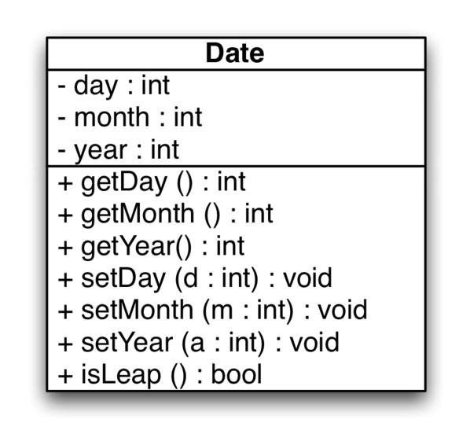
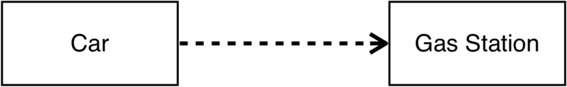

# Unit 5: Introduction to Object-Oriented Programming

The programming we have studied so far with languages ​​such as C follows the principles of the so-called **procedural paradigm**, under which a program is a collection of functions (sometimes also called **procedures**) that are invoked successively during execution. The data, in addition, are usually dissociated from the functions that manipulate them. 

In contrast, the **object-oriented programming** paradigm proposes to encapsulate the data and the functions that handle them under the concept of **class** (for example, vector is a class); these classes are **instantiated** one or more times during program execution (for example, using different vectors) to create **objects**. Therefore, a program now consists of a collection of objects that interact and communicate with each other; these objects, as we have said, are instances of one or more classes defined for the problem in question. As we will see later, classes are organized hierarchically using a mechanism known as **inheritance**.

Since different objects communicate through function calls (in fact, through a broader concept called **message passing**), object-oriented languages allow their use to some extent in programs that follow rather the procedural paradigm. C++ is a clear example of this. It is possible in principle to write C++ programs that are closer to the procedural paradigm than to the object-oriented one (as we have been doing until now), but when it comes to the truth, programmers do not usually use C++ for the first. In this unit we will not get into many details of C++ elements related to object-oriented programming, which will be done in later subjects.

## Classes and objects

As we have previously seen, we can declare a variable this way:

```cpp
int i;  // We declare a variable i of type int
```
In this case, we are not using object-oriented programming, as data types such as `int` or `float` are considered to be **simple types** and not classes.

<!---
 no clases, ya que hay cosas que podemos hacer con clases y objetos que no podemos hacer con ellos (por ejemplo, [sobrecargar sus operadores](http://www.cs.technion.ac.il/users/yechiel/c++-faq/intrinsics-and-operator-overloading.html)). 
 ---->

 However, we have already used ****objects**** in Programming 2. For example, when we declare an object of the class `string`:

```cpp
string s; // We declare an object s of the class string
```

Classes are similar to simple types, but they allow many extra functionalities.

We can consider a class as a model to create (instantiate) objects of that class. An object of a certain class is called an instance of the class (`s` is an instance of `string`). In a first approximation, a class is similar to a struct like those studied so far, but adding functions; in this way we can **encapsulate** the data and functions (also called member functions or **methods**) that manipulate them. In addition, the developer of a class can decide that only some functions can be invoked from the external code (client code) that declares and uses objects of the class (which would constitute the **public** part of the class) and that the rest of functions and even the data of the class are **private** and can only be accessed from the code of the class itself (and, sometimes, from the code of other classes with special privileges). The public part is also known as the **interface** of the class. The idea of ​​hiding certain details to the client code is called **encapsulation** and allows, among other things, that the programmer of a class modify the representation used for class data without having to modify the client code that use objects of that class.

For example, the equivalent of the following struct in C++:

```cpp
struct Date
{
   int day;
   int month;
   int year;
};
```

...would be this class:

```cpp
class Date
{
  public:
     int day;
     int month;
     int year;
}; // Important: the semicolon at the end is mandatory
```

Here, `public` means that the data can be accessed directly as in a struct. For example:

```cpp
Date d;
d.day = 12;
```

> By default, all elements of a class are `private` unless the keyword `public` is indicated.

However, as mentioned above, it is usual to **hide** from the client code the data of the class so that in our example the modification from outside the class of the `day` attribute must be done by invoking a public method of class:

```cpp
class Date
{
  private: // Only accesible from the class methods
     int day;
     int month;
     int year;
  public:
     bool setDate(int d, int m, int y) { ... };
};
```

## Basic concepts

Next, we will briefly introduce some principles on which the object-oriented paradigm is based: abstraction, encapsulation, modularity, inheritance and polymorphism.

### Abstraction

The **abstraction** is the mechanism by which we determine the essential characteristics of an object and its behavior in the context of our program, while discarding everything that is not relevant in that context. Abstraction implies renouncing a part of reality (for example, the stature of a taxpayer is not usually relevant for a tax administration application, but it probably will be in a program of dietary supervision) and to define a model suitable for a concrete purpose. The process of abstraction allows selecting the relevant characteristics within a set and identifying common behaviors to define new classes. It takes place in the design phase, which precedes the implementation phase.

### Encapsulation

The **encapsulation** means bringing together all the elements that can be considered belonging to the same entity, at the same level of abstraction. In object-oriented programming, each object can perform tasks, inform and change its state, and communicate with other objects without revealing how their characteristics are implemented; the **client code** does not have access to the implementation details and interacts with each object through the interface of its class. The interface is the part of the object that is visible to the rest of the objects (the public part): it is the set of methods (and sometimes data) that we have to communicate with an object. Each object, therefore, hides its implementation and exposes an interface to the rest of the program. Both the implementation and the interface are shared by all objects of the same class. Encapsulation protects the properties of an object against its modification: only the object's own internal methods can access its state. In addition, the developer of a class can make changes to the implementation and, as long as the interface does not change, it will not be necessary to modify the client code.

### Modularity

**Modularity** is the property that allows us to subdivide an application into smaller parts (called modules) as independent as possible. These modules (do not confound them with functions!) can be compiled separately, but they have connections with other modules. Generally, each class is implemented in an independent module, although classes with similar functionalities can belong to the same module. Ideally, the components of a module are cohesive and the coupling between modules is low; in this way, changes in a specific functionality of an application will normally involve changing the classes of a single module and not modifying those of other modules.

### Inheritance

Classes can be related to each other by forming a hierarchy of classification in a mechanism known as **inheritance**. For example, a car (**subclass**) or a motorbike (another subclass) are vehicles (**superclass**). The superclass defines the properties and common behavior, and the different subclasses specialize them. The objects of the subclasses inherit the properties and behavior of all the classes to which they belong (an object of the class **Car** is also an object of the class **Vehicle** and can be treated as one or the other). Inheritance facilitates the organization of information at different levels of abstraction. Thus, derived objects can share (and extend) their behavior without having to re-implement it. When an object inherits from more than one class it is said that there is **multiple inheritance**; C++ allows us to define multiple inheritance relationships, but not all languages do it.

### Polymorphism

The **polymorphism** is the assignment of the same interface to entities of different types. For example, the method ```move()``` could refer to different actions if it is a motorcycle or a car. In this case, the idea is that different behaviors, associated with different objects, can share the same name. Another widely used form of polymorphism is the one known as **subtype polymorphism**, in which the same variable can refer to instances of different classes that share the same superclass, as in the following polymorphic variable example:

```cpp
Animal *a = new Dog;
...
a = new Cat;
...
a = new Seagull;
```

The polymorphism implies an ambiguity that has to be resolved at some point. When this occurs in **execution time**, this last characteristic is called late or dynamic assignment. Some languages provide more static means (in **compilation time**) of polymorphism, such as the **templates** and the overload of C++ operators.

## Object Oriented Programming in C++

### Syntax

The following header file defines the ```SpaceShip``` class with a series of private attributes (which are not part of the public interface of the objects in the class) and a series of methods that manipulate them (also known as **member functions**):

```cpp
// SpaceShip.h (class declaration)
class SpaceShip 
{
   private:
       int maxSpeed;
       string name;
   public:
       SpaceShip(int maxSpeed, string name); // Constructor
       ~SpaceShip();  // Destructor
       int trip(int distance);
       string getName() const;
};
```

The implementation of the methods from the `SpaceShip` class is usually done in another file:

```cpp
// SpaceShip.cc (methods implementation)

#include "SpaceShip.h"

// Constructor
SpaceShip::SpaceShip(int maxSpeed, string name) 
{
  this->maxSpeed = maxSpeed;
  this->name = name;
}

SpaceShip::~SpaceShip()  // Destructor
{
}

int SpaceShip::trip(int distance) 
{
  return distance/maxSpeed;
}

string SpaceShip::getName() const 
{
  return name;
}
```

Many of the details of the previous code will be analyzed in the next sections.

### Modular design

In C++, the ```main``` program use and communicate the classes. A ```Class``` is implemented with two source files: ```Class.h```, which contains constants that are used in this file, the declaration of the class and its methods; and ```Class.cc```, which contains constants that are used in this file and the implementation of the methods (and sometimes the implementation of internal types used by the class).

Actually, the task of translating a source program into executable is done in two phases:

- Compilation: in C++, the compiler translates a source program into a program in object code (not executable yet)
- Link: the **linker** of C++ joins the program in object code with the language (C/C++) libraries and generates the executable

In C++, the two phases are carried out at the same time with the following instruction:

```
g++ program.cc -o program
```

With the `-c` option, however, compilation is only done to obtain the object code (.o) but without calling the linker:

```
g++ program.cc -c
```

When a program is composed of several classes, each class must be compiled separately to obtain the executable. This process produces several files in object code and then they they must be linked with the libraries to generate an executable. To compile each module and the main program separately, the following should be executed:

```
g++ -Wall -g -c C1.cc
g++ -Wall -g -c C2.cc
g++ -Wall -g -c prog.cc
```

To obtain the executable we must link the compiled classes and the program:

```
g++ -Wall -g C1.o C2.o prog.o -o prog
```

In the case of small programs, these two stages can be done in a single step using:

```
g++ -Wall -g C1.cc C2.cc prog.cc -o prog
```

However, when the programs are large, we can not recompile all the files every time after having made a minimum change in one of them, since the necessary time can be very high. Later we will see how the `make` program is used to manage projects with tens, hundreds or even thousands of classes.

### A class example in C++

The following lines show the code generated for the `Rect` class represented in the following UML class diagram:


```cpp
// Rect.h (class declaration)
class Rect
{
   private:
       int x1, y1, x2, y2;
   public:
       Rect(int ax, int ay, int bx,int by); // Constructor
       ~Rect();  // Destructor
       int base();
       int altura();
       int area();
};
```

```cpp
// Rect.cc (methods implementation)
Rect::Rect(int ax, int ay, int bx, int by)
{
   x1=ax;  
   y1=ay;  
   x2=bx;  
   y2=by;
}

Rect::~Rect()  // Destructor (empty)
{
}

int Rect::base() 
{ 
  return (x2-x1); 
}

int Rect::height() 
{ 
  return (y2-y1); 
}

int Rect::area() 
{
  return base() * height();
}
```

```cpp
// main.cc
int main()
{
     Rect r(10,20,40,50);
     cout << r.area() << endl;
}
```

### Inline functions

In scenarios where performance is important, methods with little code (for example, just one or two lines) can also be implemented directly in the class declaration. The code generated for the `inline` functions is inserted at each point where the function is invoked, instead of just doing it once in another place and making a call. For a function to be considered as `inline` it is enough to define it within the declaration of the class:

```cpp
// Rect.h (class declaration)
class Rect
{
   private:
       int x1, y1, x2, y2;
   public:
       Rect(int ax, int ay, int bx,int by);
       ~Rect() {};  // Inline
       int base() { return (x2-x1); };  // Inline
       int height() { return (y2-y1); }; // Inline
       int area();
};
```

Inline functions can also be implemented outside the class declaration (in the `.cc`) using the corresponding reserved word.

```cpp
inline int Rect::base()
{
  return (x2-x1);
}
```

It should be noted that the compiler can decide by itself not to implement as *inline* a function that in principle has been declared as such.

### Accessors

Because of the encapsulation principle already mentioned, it is not convenient to allow the client code to directly access the member data of a class. Usuually, we define member data as `private` and implement **setters/getters/is** functions (also called **accessors**) that allow access them from outside the class.




The `set` accessors allow us to control that the values of the attributes are correct and only modify them after checking the correctness of the new values.

### Canonical form

All classes must implement at least four important methods:

- Constructor
- Destructor
- Copy constructor
- Assignment operator (we will not study it in this course)

These operations are known as **canonical form** of a class in C++ and the compiler defines them *by default* if the programmer does not provide them.

### Constructors

Classes usually have at least one *constructor* and one *destructor* method. The constructor is invoked automatically when an object of the class is created, and the destructor when it is finished. The constructor is usually responsible for initializing the attributes of the object and reserving additional resources such as the dynamic memory needed for them; the destructor usually releases these resources. If we do not define any constructor, the compiler will create one by default without parameters, and that will do nothing. The member data of the objects declared this way will contain garbage. In a class there may be several constructors with different parameters. In this case, we say that the constructor is **overloaded** (the overload is a type of polymorphism), as in the following example:

```cpp
Date::Date()
{
  day=1;
  month=1;
  year=1900;
}
Date::Date(int d, int m, int y) {
  day=d;
  month=m;
  year=y;
}
```

The following are three call examples for the previous constructors:

```cpp
Date d;
Date d(10,2,2010);
Date *d1= new Date(11,11,2011);
```

Note that although in other languages the following code is a valid way to run the constructor without parameters, in C++ it is not valid:

```cpp
Date d(); // compilation error
```

Constructors can have parameters with default values that are only given in the `.h` file:

```cpp
Date(int d=1,int m=1,int y=1900);
```

With this constructor we can then create an object in several ways:

```cpp
Date d;
Date d(10,2,2010);
Date d(10);  // day=10
```

### Exceptions

Exceptions are the mechanism that allows efficient management of errors that, for various reasons, occur in a program during its execution. A common use of exceptions occurs when a constructor can not create the corresponding object because the parameters supplied by the client code are incorrect. In cases like this, the constructor detects the error but does not know what to do to fix it (it may be to change the value of the incorrect parameter and try again, display a message and ask for a new value from the console, inform the user through a window interface, emit an alert sound, immediately finish the execution of the program, etc.). In this case, it is the client code invoked by the constructor the one that probably knows what needs to be done to deal with the error. At other times, the error handling can not be done either in the function that invoked the constructor, but in the function that invoked this function... The idea here is that once an exception is thrown at the point where the error is detected, the exception will run *backwards* through the program, to a place where it will be *captured* and treated. Exceptions are not necessary in those cases in which the same function that detects an error is able to manage the situation and solve the problem.

Exceptions in C++ are thrown with the ```throw``` command and captured in a ```try``` / ```catch``` block in which the ```try``` part contains the code that can potentially throw an exception, and the ```catch``` part contains the code that manages the error. If an exception occurs and is not captured even from the ```main``` function, the program will terminate. The ```root``` function in the following example throws an exception if its parameter is negative. The ```main``` function captures the exception and displays an error message.

```cpp
int root(int n)
{
  if (n<0)
    throw exception(); // The function ends with an exception

  return sqrt(n);
}

int main()
{
  try  // We try to run the next instructions
  {
    int result=root(-1);  // An exception is thrown
    cout << result << endl; // This instruction is executed only if no exceptions are given
  }
  catch(...) // If there is an exception, we can capture it here
  {
     cerr << "Negative number" <<  endl;
  }
}
```

This is an example of a constructor throwing an exception:

```cpp
Coordinate::Coordinate(int cx, int cy)
{
   if (cx>=0 && cy>=0)
   {
      x=cx;
      y=cy;
   }
   else throw exception();
}
```

```cpp
int main()
{
   try
   {
      Coordinate c(-2,4); // This object is not created
   }
   catch(...) 
   {
      cout << "Wrong coordinate" << endl;
   }
}
```

### Destructors

All C++ classes need a destructor (if not specified, the compiler creates one by default). A destructor must release the resources (normally, dynamic memory) that the object has been using. A destructor is a member function with no parameters, which returns no value and with the same name as the class but preceded by the character ```~```. A class can only have a destructor function. The compiler generates code that automatically calls a destructor of an object when its scope ends. The destructor is also called when using ```delete```. It can be invoked explicitly in the form ```d.~Date()```, although there are very few situations in which this explicit invocation is necessary.

```cpp
   // Declaration
   ~Date();

   // Implementation
   Date::~Date()
   {
      // Free dynamic memory allocated (nothing in this case)
   }
```

The destructor that is generated by default by the compiler invokes the destructors of all the attributes of the class when these are also objects.

### Copy constructors

Similar to an assignment, a copy constructor creates an object from another existing object. These constructors have only one parameter, which is a reference to an object of the same class.

```cpp
// Declaration
Date(const Date &d);

// Implementation
Date::Date(const Date &d) :
   day(d.day), month(d.month), year(d.year) {}
```

The copy constructor is invoked automatically when:

- A function returns an object (but not a pointer or a reference to an object)

- An object is declared using the assignment operator:

```cpp
Date d2(d1);
Date d2 = d1;  // this instruction is equivalent to the previous one
d1=d2; // in this case the copy constructor is NOT called, but the operator =
```

- An object is passed by value to a function (but not when passing pointers or references):

```cpp
void function(Date d1);
function(d1);
```

If no copy constructor is specified, the compiler creates one by default with the same behavior as the `=` operator

### Assignment operator

We can do a direct assignment of two objects (without using copy constructors) using the assignment operator.

```cpp
Date d1(10,2,2011);
Date d2;
d2 = d1;  // Direct copy of member data values
```

By default, the compiler creates an assignment operator `=` that copies each attribute bit by bit. We can redefine it for our classes if we consider it necessary, but we will not do it in this subject.

### Constant methods

As with the variables of simple types, it is sometimes useful to define constant objects whose initial state (that is, the value of their attributes set by the constructor) can not change during the execution of the program. C++ allows declaring *constant methods* that do not modify the value of the attributes:

```cpp
int Date::getDay() const  // constant method
{
    return day;
}
```

We can't call non-constant methods from a constant object. For example, the following code would not compile:

```cpp
int Date::getDay()
{
   return day;
}

int main()
{
   const Date d(10,10,2011);
   cout << d.getDay() << endl;
}
```

In the same way, the compiler would issue an error if we try to modify the attributes of the object from a constant method. Obviously, all `get` methods should be constant.

### Friend functions

In principle, the private part of a class (whether they are methods or attributes) is only accessible from the methods of the class itself, but sometimes it is convenient to be able to skip this rule to allow functions not defined in the class to access its private elements. For this, a function can be declared as *friend* of the class in the following way:


```cpp
class MyClass 
{
  friend void aFriendFunction(int c, MyClass& m);
public:
  //...
private:
   int privateData;
};
```

```cpp
void aFriendFunction(int x, MyClass& c)
{
  m.privateData = c; // Accessing the private part is allowed here
}
```

As a general rule, you should **never use a friend function** because it violates the encapsulation principle. However, in C++, friend functions are the only way allowed to overlead input/output operators, as will be seen next. Therefore, as it is the only alternative, friend functions are allowed in Programming 2 for overloading these operators, although you should not declare a friend function for other purpose.

### Overloading input/output operators

In C++ we can **overload the input/output operators** of any kind. In general, most operators of the language can be overloaded, but it is recommended not to assign them operations with different meanings. For example, the ```operator+``` should be overloaded to reflect operations similar to sums or concatenations, but never for something like, for example, looking for an item in a list.

Overloading is used to allow with a simple syntax the modification of the state of an object given the values supplied by an `ifstream` (for example, `cin`) or the dump of the current state on an `ofstream` class object (for example, `cout`):

```cpp
MyClass c1, c2;
cin >> c1;   // Input operator
cout << c1;  // Output operator
c1 = c1 + c2; // Sum operator
```

The problem of overloading is that operators could not be member functions of `MyClass` because the first operand is not an object of that class (it is a `stream`). In addition, we can not add the functions that overload the operators to the `ifstream` or `ofstream` classes because they belong to the C++ library that, in principle, we can not modify. The solution provided in C++ is to declare the overload functions of the operators outside any class, but making them to be *friend* of  ```MyClass``` in order to access their private elements:

```cpp
friend ostream& operator<< (ostream &os, const MyClass& obj);
friend istream& operator>> (istream &is, MyClass& obj);
```

For example, the declaration of these operators for a class `Date` would be:

```cpp
class Date
{
 friend ostream& operator<< (ostream &os, const Date& d);
 friend istream& operator>> (istream &is, Date& d);

 public:
   Date(int day=1, int month=1, int year=1900);
   ...
 private:
   int day, month, year;
};
```

And a possible implementation would be the following:

```cpp
ostream& operator<< (ostream &os, const Date& d)
{
  os << d.day << "/" << d.month << "/" << d.year;
  return os;
}
```

```cpp
istream& operator>> (istream &is, Date& d)
{
  char dummy;
  is >> d.day >> dummy >> d.month >> dummy >> d.year;
  return is;
}
```

-----

### Exercise 1

Implement the class of the following diagram:


You must create the files `Coordenada.cc` and `Coordenada.h`, and a `makefile` to compile them with a `main.cc` program. In the `main` function, the user should be asked for two numbers and create a coordinate with them to print it with the output operator in the format `x,y`. Write the necessary code so that each method is used at least once.

-----

### Static attributes and methods

*Class attributes* and *class methods* are also called *static*. They are represented as underlined in the UML diagrams. A class attribute is a variable that exists in a single memory location and is shared by all the objects from that class. Class methods, on the other hand, can only access class attributes.

Sometimes static attributes are necessary, for example in the following example, where there are some constants that are shared by all the objects of the class Date. This is more efficient than having non-static constants, as they would be declared for each single object:

```cpp
class Date
{
  public:
    static const int weeksPerYear = 52;
    static const int daysPerWeek = 7;
    static const int daysPerYear = 365;
    static string getFormat();
    static bool setFormat(string);
    void setDay(int d);
    void getDay();
    ...
  private:
    static string format;
    int dia;
    int mes;
    int año;
};
```

This code shows an example of how to access static attributes or methods from outside the class:

```cpp
cout << Date::daysPerWeek << endl;  // static atribute
cout << Date::getFormat() << endl;  // static method
```

> Do you remember ```string::npos```? It is a constant class attribute from string.

In addition, there may be *static* variables, as in the case of *format* from the previous example, which is not constant. This means that if any object modifies this value, then it will change for all the objects of the class ```Date```.

When the static attribute is not a simple type or is not constant, it must be declared inside the class, but taking its value outside it:

```cpp
// Date.h (inside the class declaration)
static const string endoftheworld;

// Fecha.cc
const string Date::endoftheworld="2112";
```

Static methods can only access to static attributes. This makes sense, since the method ```getFormat``` from the previous example is called as ```Date::getFormat()```, therefore it can only modify those attributes shared from all objects, but not those from a particular object because the target object it is not given in the method call.

### The ```this``` pointer

The ```this``` pointer is a pseudo variable that is not explicitly declared anywhere in the program and can not be modified explicitly. It is an implicit argument that all member functions (excluding ```static``` functions) receive, and it points to the object receiving the current message. It is usually omitted when accessing attributes through member functions. However, it is necessary to use ```this``` when we want to refer to an attribute of the object and there is a homonymous variable declared in its scope, or when we want to pass the object to a nested function as an argument. For example:

```cpp
void Date::setDay (int day)
{
    // day=day;      // assigns the value of the parameter to the parameter itself.
    this->day=day;  //  assigns the value of the parameter to the attribute of the current object
    cout << this->day << endl; // prints the attribute
}
```

Therefore, ```this``` can be used to disambiguate between the attributes of the class and the parameter names received. This could be solved by simply changing the parameter name, but sometimes this is necessary, for example when we want to refer to the current object:

```cpp
void Date::myFunction() 
{
  MyClass c;

  c.addObject(*this); // Here we are passing the current object as parameter for an external function.
}
```

## Relationships

There are different types of relationships that can be established between objects and classes. The following figure shows the ones we are going to study in this section, along with the graphic notation that is used in UML diagrams to represent them.


Relationships have a *cardinality* which defines the number of classes or objects that may be involved. This cardinality can be:

- One or more: represented with 1..* (or also 1..*n*, if there is a maximum)
- Zero or more: represented with *
- A constant number: *m*


### Aggregation and composition

The *aggregation* and the *composition* are *all-part* relationships, in which one object (or several) is part of the nature of another. Unlike association, they are asymmetric relationships. The differences between aggregation and composition are the strength of the relationship: Aggregation is a weaker relationship than composition. Consider, for example, the following class diagram:


In the case of the *strong* relation of composition (represented in UML by means of a filled rhombus on the side of the class *all*), when the container object is destroyed the objects it contains are also destroyed. Thus, the wing is part of the plane and we can consider that in our application it does not make sense to have a wing out of a plane. If we sell an airplane, we do it including its wings; If we take a plane to the scrapyard for disposal, we do not keep its wings.

In the case of aggregation (represented in UML by an empty rhombus on the side of the class *all*), this is not the case: the object part can exist without the whole. The aggregation relation of the figure reflects that we can sell a team, but the players could go later to another club.

Some relationships can be considered either as aggregations or compositions, depending on the context and their application (for example, the relationship between bicycle and wheel).

Some authors consider that the only difference between both concepts lies in their implementation; thus a composition would be an *aggregation by value*. The composition is the relationship that we will use the most in Programming 2. 

The following figure represents schematically how several compositions with different cardinalities are implemented:


In these compositions, the `A` class (the class that represents the *all*) has its own copy of the `B` class objects, so the deletion of an object of the `A` class implies the deletion of your `B` class objects. In the aggregation, however, the `A` class includes pointers to objects of class `B` created outside `A` whose life cycle is not managed by class A:


The following code shows an example of the aggregation relationship and the instantiation of the corresponding objects:

```cpp
class A 
{
   private:
      B *b;
   public:
      A (B *b) 
      {
         this->b = b;
      }
      ...
};
```

```cpp
int main()
{
   // Two ways:
   // 1- Using a pointer
   B *b = new B;
   A a(b);

   // 2- Using an object
   B b;
   A a(&b);
}
```

<!---
The comments in the previous paragraphs constitute a basic approach to the implementation of *all-part* relationships, but this implementation may be different in certain contexts. For example, if the cardinality of a composition is 0..1, it may be interesting to implement it using a pointer that is null or non-zero depending on whether the object *part* exists. In any case, to maintain the nature of the relationship, the class *all* will probably have to create a deep copy of the object *part* in order to allow it to control its life cycle.
---->

### Association

The association expresses a general relation (usually bidirectional) between the objects instantiated from the connected classes. For example, the following figure expresses that a worker works in one or more projects, and that a project can have zero or more workers. 


It can be implemented in C++ using pointers between both classes, in `A` and also in `B` so that `B` could reference `A` and `A` could reference `B`. If these classes are in separate header files, then it is required to use [forward class declaration](https://en.wikipedia.org/wiki/Circular_dependency#Example_of_circular_dependencies_in_C++). We will not use these kind of relations in Programming 2.

### Use

Unlike the previous relationships, the *use* is a non-persistent relation. This means that after the relation, all contact between the objects is finished. We will say that an `A` class uses a `B` class when:

- Invokes some method of class `B`.
- It has some instance of the class `B` as a parameter of one of its methods.
- Access to `B` private variables (this can only be done if they are *friend* classes).

The following UML diagram and its corresponding C++ code represent a use relationship of the `Gas station` class for the `Car` class that fits the first two cases of the previous list.




```cpp
float Car::Refuel(GasStation &g, float litres) 
{
  float amount=g.sellGas(litres, typeC); 
  lgas= lgas+litres;
  return amount;
}
```

### Generalization (inheritance)

The *inheritance* is the mechanism of object-oriented languages that allows defining a new class (*derived* class or *subclass*) as a specialization of another (*base class* or *superclass*). It is used when there are sufficient similarities between them and the characteristics of the base class are suitable for the derived class.

The following UML class diagram shows an inheritance hierarchy in which the subclasses `Dog` and `Cat` inherit the methods and attributes specified by the `Mammal` superclass.


Inheritance allows us to adopt characteristics already implemented by other classes and refine or replace them in derived classes. The following code shows a `Rectangle` class that derives from a `Shape` class. The attributes declared as `protected` are those only visible in the derived classes (unlike the private ones), but they are not public.


```cpp
class Shape   // Base class
{
   public:
      void setWidth(int w)  
      {
         width = w;
      }
      void setHeight(int h) 
      {
         height = h;
      }
   protected:
      int width;
      int height;
};
```

```cpp
class Rectangle: public Shape   // Derived class
{
   public:
      int getArea()
       {
         return (width * height);
      }
};
```

```cpp
int main()
{
   Rectangle rect;

   // We can call the methods of the base class
   rect.setWidth(5);
   rect.setHeight(7);

   // ...and also those of the derived class
   cout << "Total area: " << rect.getArea() << endl;
}
```


## The *Make* program

Let's suppose the case of a `Class.h` header file that is used in several `.cc` files. If we change something in the header file, it does not make sense to recompile all the code of the program, but only those files that use `Class.h`. The `make` program helps compile large programs composed of many files. It allows us to define the **dependencies** between the different source code files so that a specific file would only recompiled when its content changes or that of one of the files on which it depends.

A text file called `makefile` specifies the dependencies between the files and what to do when they change. If we execute `make` inside a given directory, it will search by default for a `makefile` file that contains one or more **targets** to be built by `make`. The `makefile` has a main target (usually the executable program) followed by other secondary targets. The format of each target is:

```
<target> : <dependencies>
[tab]<instruction>
```

The algorithm of the `make` program is simple and can be defined informally as: "If the date of some dependency is more recent than that of the target, execute the instruction". An example of a `makefile` for a project with two classes `C1` and `C2` and a `prog.cc` file whose main program uses both classes would be as follows:

```
prog : C1.o C2.o prog.o
        g++ -Wall -g C1.o C2.o prog.o -o prog

C1.o : C1.cc C1.h
        g++ -Wall -g -c C1.cc
C2.o : C2.cc C2.h C1.h
        g++ -Wall -g -c C2.cc
prog.o : prog.cc C1.h C2.h
        g++ -Wall -g -c prog.cc
```

If `C2.cc` is changed and we run `make`, the following instructions would be executed:

```
g++ -Wall -g -c C2.cc
g++ -Wall -g C1.o C2.o prog.o -o prog
```

If `C2.h` is changed and we run `make`, then these ones would be executed:

```
g++ -Wall -g -c C2.cc
g++ -Wall -g -c prog.cc
g++ -Wall -g C1.o C2.o prog.o -o prog
```

We can define constants or variables that are replaced where appropriate. An improved version of the `makefile` above that uses some constants would be:

```
CC = g++
CFLAGS = –Wall -g
MODULES = C1.o C2.o prog.o

prog : $(MODULES)
        $(CC) $(CFLAGS) $(MODULES) -o prog

C1.o : C1.cc C1.h
        $(CC) $(CFLAGS) -c C1.cc
C2.o : C2.cc C2.h C1.h
        $(CC) $(CFLAGS) -c C2.cc
prog.o : prog.cc C1.h C2.h
        $(CC) $(CFLAGS) -c prog.cc
clean:
        rm -rf $(MODULES)
```

-----

### Exercise 2

Implement the code corresponding to the following class diagram:


You must create a program that creates a new invoice (`Factura`), add a product and prints it. 

From the `Factura` constructor you must call the `getSigid` method, which should return the value of `sigid` and increase it. This is an example of output when printing an invoice:

```
Factura nº: 12345
Fecha: 18/4/2011

Datos del cliente
----------------------
Nombre: Agapito Piedralisa
Dirección: c/ Río Seco, 2
Teléfono: 123456789

Detalle de la factura
---------------------
Línea;Producto;Cantidad;Precio ud.;Precio total
--
1;Ratón USB;1;8,43;8,43
2;Memoria RAM 2GB;2;21,15;42,3
3;Altavoces;1;12,66;12,66

Subtotal: 63,39 €
IVA (18%): 11,41 €
TOTAL: 74.8002 €
```

-----

