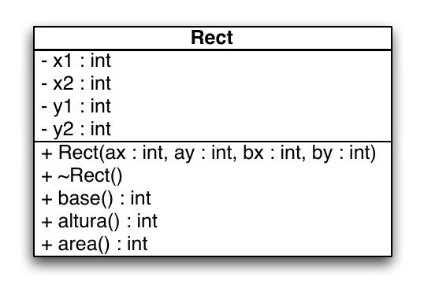
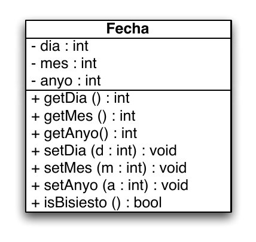
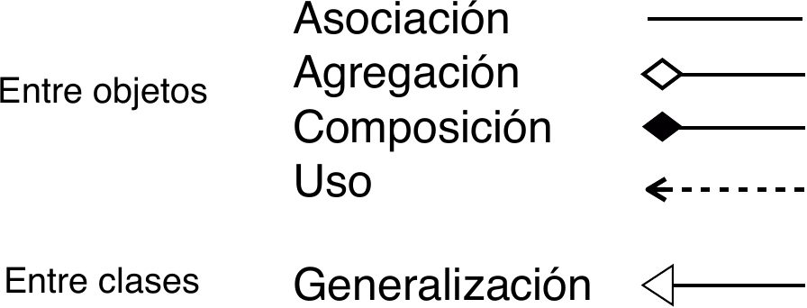
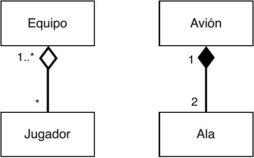
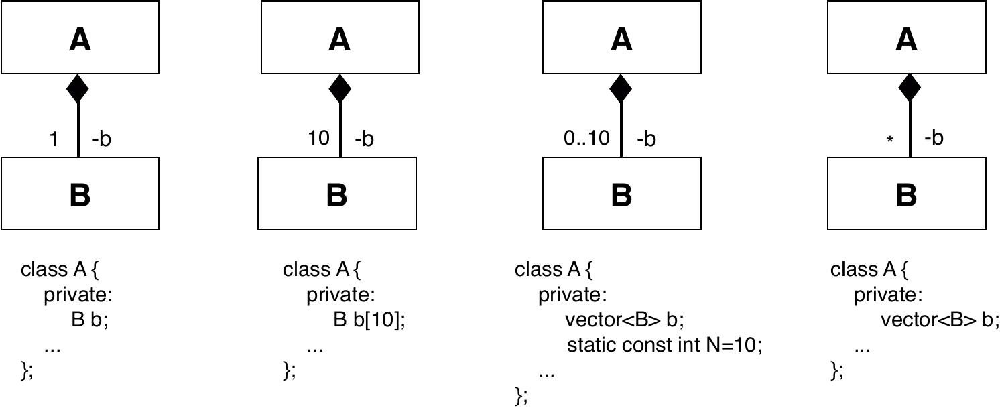
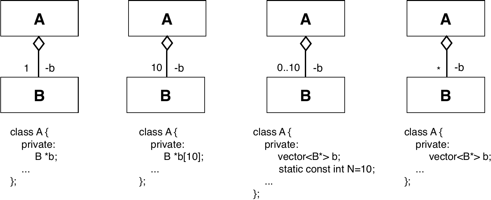
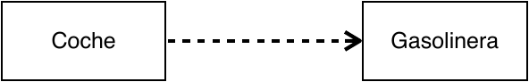
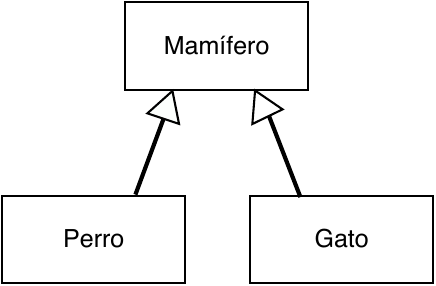
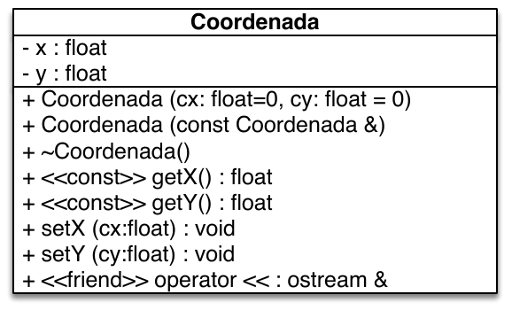
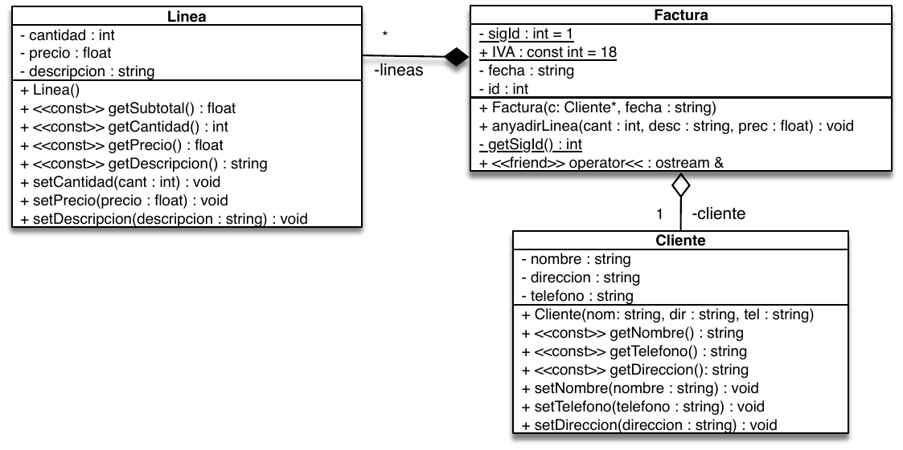

# Tema 5: Introducción a la programación orientada a objetos (en construcción)

## Introducción a la programación orientada a objetos

### Definición

La programación que hemos estudiado hasta ahora con lenguajes como C sigue los principios del llamado *paradigma procedimental*, bajo el que un programa es una colección de funciones (a veces llamadas también *procedimientos*) que se invocan sucesivamente durante la ejecución. Los datos, además, suelen estar disociados de las funciones que los manipulan. El paradigma de la *programación orientada a objetos* propone encapsular los datos y las funciones que los manejan bajo el concepto de *clase* (por ejemplo, una clase de tipo vector); estas clases se *instancian* una o más veces durante la ejecución del programa (por ejemplo, usando distintos vectores) para crear *objetos*. Así, un programa se compone ahora de una colección de objetos que interactúan y se comunican entre ellos; estos objetos, como hemos dicho, son instancias de una o más clases definidas para el problema en cuestión. Como veremos más adelante, las clases se organizan de forma jerárquica mediante un mecanismo conocido como *herencia*.

Ya que los distintos objetos se comunican mediante llamadas a funciones (en realidad, mediante un concepto más amplio denominado *paso de mensajes*), los lenguajes orientados a objetos permiten hasta cierto punto su uso en programas que siguen más bien el paradigma procedimental. C++ es un claro ejemplo de ello. Aunque no todos los programas escritos en C son válidos en C++ (ni, evidentemente, a la inversa), muchos de ellos pueden ser transformados de forma relativamente sencilla en programas de C++. Por tanto, es posible en principio escribir programas en C++ que están más cerca del paradigma procedimental que del orientado a objetos, pero a la hora de la verdad los programadores no suelen usar C++ para lo primero. En este curso no ahondaremos excesivamente en los elementos de C++ relacionados con la programación orientada a objetos, lo que se hará en cursos posteriores.

### Clases y objetos

En la asignatura ya hemos usado clases y objetos. No lo hemos hecho cuando declaramos una variable como

```cpp
int i;  // Declaramos una variable i de tipo int
```

ya que en C++ los tipos como `int` o `float` se consideran *tipos primitivos* y no clases, ya que hay cosas que podemos hacer con clases y objetos que no podemos hacer con ellos (por ejemplo, [sobrecargar sus operadores](http://www.cs.technion.ac.il/users/yechiel/c++-faq/intrinsics-and-operator-overloading.html)). Sin embargo, sí hemos declarado objetos del tipo (o clase) `string`:

```cpp
string s; // Declaramos un objeto s de clase string
```

Las clases o tipos compuestos son similares a los tipos simples (o primitivos) pero permiten muchas más funcionalidades.

Podemos considerar una clase como un modelo para crear (instanciar) objetos de ese tipo que define las características que les son comunes a todos ellos. Un objeto de una determinada clase se denomina una instancia de la clase (`s` es  una instancia de `string`). En una primera aproximación, una clase es similar a un registro como los estudiados hasta el momento, pero añadiendo funciones; de esta manera conseguimos *encapsular* los datos y las funciones (llamadas también funciones miembro o *métodos* miembro) que los manipulan. Además, el programador de una clase puede decidir que solo algunas funciones se puedan invocar desde el código externo (código cliente) que declara y usa objetos de la clase (lo que constituiría la parte *pública* de la clase) y que el resto de funciones e incluso los datos de la clase sean *privados* y solo se pueda acceder a ellos desde el código de la propia clase (y, a veces, desde el código de otras clases con privilegios especiales). A la parte pública se le conoce también como *interfaz* de la clase. A la idea de esconder ciertos detalles al código cliente se le denomina *ocultación de información* y permite, entre otras cosas, que el programador de una clase modifique la representación usada para los datos de la clase sin que haya que modificar el código cliente que usa objetos de dicha clase.

El equivalente aproximado al siguiente registro en C o C++:

```cpp
struct Fecha {
   int dia;
   int mes;
   int anyo;
};
```

sería una clase como la siguiente:

```cpp
class Fecha {
  public:
     int dia;
     int mes;
     int anyo;
}; // Ojo: el punto y coma del final es necesario
```

Si no se indica lo contrario (con la palabra reservada `public`), todos los miembros de la clase son privados. El acceso a los elementos públicos de un objeto se realiza de forma similar a como se hace con registros:

```cpp
Fecha f;
f.dia=12;
```

Sin embargo, como se ha comentado anteriormente, lo habitual es *esconder* del código cliente los datos de la clase de forma que en nuestro ejemplo la modificación desde fuera de la clase del atributo `dia` se tenga que realizar invocando un método público de la clase:

```cpp
class Fecha {
  private: // Solo accesible desde metodos de la clase
     int dia;
     int mes;
     int anyo;
  public:
     bool setFecha(int d, int m, int a) { ... };
};
```

## Conceptos básicos

A continuación, introduciremos brevemente algunos principios en los que se basa el paradigma orientado a objetos, a saber: abstracción, encapsulación, modularidad, herencia y polimorfismo.

### Abstracción

La *abstracción* es el mecanismo mediante el que determinamos las características esenciales de un objeto y su comportamiento en el contexto del programa que queremos escribir, a la vez que descartamos todo aquello que no es relevante en dicho contexto. La abstracción implica renunciar a una parte de la realidad (por ejemplo, la estatura de un contribuyente no suele ser relevante para una aplicación de gestión tributaria, pero sí lo será probablemente en un programa de supervisión dietética) y definir un modelo de esta adecuado para un propósito concreto. El proceso de abstracción permite seleccionar las características relevantes dentro de un conjunto e identificar comportamientos comunes para definir nuevas clases, y tiene lugar en la fase de diseño, que precede a la de implemenmtación.

### Encapsulación

La *encapsulación* significa reunir a todos los elementos que pueden considerarse pertenecientes a una misma entidad, al mismo nivel de abstracción. En programación orientada a objetos, cada objeto puede realizar tareas, informar y cambiar su estado, y comunicarse con otros objetos en el sistema sin revelar cómo se implementan estas características; el *código cliente* no tiene acceso a los detalles de implementación e interactúa con cada objeto a través de la interfaz de su clase. La interfaz es la parte del objeto que es visible para el resto de los objetos (la parte pública): es el conjunto de métodos (y a veces datos) del cual disponemos para comunicarnos con un objeto. Cada objeto, por tanto, oculta su implementación y expone al resto de la aplicación una interfaz. Tanto la implementación como la interfaz son compartidas por todos los objetos de la misma clase. La encapsulación protege a las propiedades de un objeto contra su modificación: solamente los propios métodos internos del objeto pueden acceder a su estado. Además, el programador de una clase puede realizar cambios en la implementación y, mientras la interfaz no cambie, no será necesario modificar el código cliente.

### Modularidad

Se denomina *modularidad* a la propiedad que permite subdividir una aplicación en partes más pequeñas (llamadas módulos) tan independientes como sea posible. Estos módulos se pueden compilar por separado, pero tienen conexiones con otros módulos. Generalmente, cada clase se implementa en un módulo independiente, aunque clases con funcionalidades similares pueden pertenecer al mismo módulo módulo. Lo ideal es que los componentes de un módulo estén bien cohesionados y que el acoplamiento entre módulos sea bajo; de esta manera, los cambios en una funcionalidad concreta de una aplicación implicarán normalmente cambiar las clases de un único módulo y no modificar las de otros módulos.

### Herencia

Las clases se pueden relacionar entre sí formando una jerarquía de clasificación en un mecanismo conocido como *herencia*. Por ejemplo, un coche (*subclase*) o una moto (otra subclase) son vehículos (*superclase*). La superclase define las propiedades y comportamiento común y las diferentes subclases los especializan. Los objetos de las subclases heredan las propiedades y el comportamiento de todas las clases a las que pertenecen (un objeto de la clase *Coche* es también un objeto de la clase *Vehículo* y puede ser tratado a conveniencia como uno u otro). La herencia facilita la organización de la información en diferentes niveles de abstracción. Así, los objetos derivados pueden compartir (y extender) su comportamiento sin tener que volver a implementarlo. Cuando un objeto hereda de más de una clase se dice que hay *herencia múltiple*; C++ permite definir relaciones de herencia múltiple, pero no todos los lenguajes lo hacen.

### Polimorfismo

El *polimorfismo* es la asignación de la misma interfaz a entidades de tipos diferentes; por ejemplo, el método `desplazate()` puede referirse a acciones distintas si se trata de una moto o de un coche. En este caso la idea es que comportamientos diferentes, asociados a objetos distintos, pueden compartir el mismo nombre. Otra de las formas más usadas de polimorfismo es el conocido como *polimorfismo de subtipos* en el que una misma variable puede referenciar a instancias de diferentes clases que comparten una misma superclase, como en el siguiente ejemplo de variable polimórfica:

```cpp
Animal *a = new Perro;
...
a = new Gato;
...
a = new Gaviota;
```

El polimorfismo implica una ambigüedad que ha de ser resuelta en algún momento. Cuando esto ocurre en *tiempo de ejecución*, esta última característica se llama asignación tardía o asignación dinámica. Algunos lenguajes proporcionan medios más estáticos (en *tiempo de compilación*) de polimorfismo, tales como las plantillas (*templates*) y la sobrecarga de operadores de C++.

## Programación orientada a objetos en C++

### Sintaxis

El siguiente fichero de cabecera define la clase `SpaceShip` con una serie de atributos privados (que no forman parte de la interfaz pública de los objetos de la clase) y una serie de métodos que los manipulan (también conocidos como *funciones miembro*):

```cpp
// SpaceShip.h (declaracion de la clase)
class SpaceShip {
   private:
       int maxSpeed;
       string name;
   public:
       SpaceShip(int maxSpeed, string name); // Constructor
       ~SpaceShip();  // Destructor
       int trip(int distance);
       string getName() const;
};
```

La implementación de los métodos de la clase `SpaceShip` se realiza habitualmente en otro fichero:

```cpp
// SpaceShip.cc (implementacion de los metodos)

#include "SpaceShip.h"

// Constructor
SpaceShip::SpaceShip(int maxSpeed, string name) {
  this->maxSpeed = maxSpeed;
  this->name = name;
}

SpaceShip::~SpaceShip() {}  // Destructor

int SpaceShip::trip(int distance) {
  return distance/maxSpeed;
}

string SpaceShip::getName() const {
  return name;
}
```

Muchas de las características del código anterior se irán analizando en las próximas secciones.

### Diseño modular

En C++ e programa principal `main` usa y comunica las clases. Una clase `Clase` se implementa con dos ficheros fuente: `Clase.h`, que contiene constantes que se usen en este fichero, la declaración de la clase y la de sus métodos; y `Clase.cc`, que contiene constantes que se usen en este fichero y la implementación de los métodos (y puede que la de tipos internos que use la clase).

La tarea de traducir un programa fuente en ejecutable se realiza en dos fases:

- Compilación: en C++ el compilador traduce un programa fuente en un programa en código objeto (no ejecutable)
- Enlace: el enlazador o *linker* de C++ junta el programa en código objeto con las librerías del lenguaje (C/C++) y genera el ejecutable

En C++, se realizan las dos fases a la vez con la siguiente instrucción:

```
g++ programa.cc -o programa
```

Con la opción `-c`, sin embargo, solo se realiza la compilación a código objeto (.o) pero sin hacer el enlace:

```
g++ programa.cc -c
```

Cuando un programa se compone de varias clases, para obtener el ejecutable se debe compilar cada clase por separado, obteniendo varios ficheros en código objeto y, a continuación, enlazar los ficheros en código objeto (las clases compiladas) con las librerías y generar un ejecutable. Para compilar cada módulo y el programa principal por separado se ejecutaría lo siguiente:

```
g++ -Wall -g -c C1.cc
g++ -Wall -g -c C2.cc
g++ -Wall -g -c prog.cc
```

Para enlazar las clases compiladas y el programa, y obtener el ejecutable, haríamos:

```
g++ -Wall -g C1.o C2.o prog.o -o prog
```

En el caso de programas pequeños, puede hacerse todo de una vez con:

```
g++ -Wall -g C1.cc C2.cc prog.cc -o prog
```

Cuando los programas son más grandes, no podemos recompilar cada vez todos los ficheros tras haber hecho un cambio mínimo en uno de ellos, ya que el tiempo necesario puede ser muy grande y entorpecer la labor del desarrollador. Más adelante veremos cómo el programa `make` se emplea para gestionar proyectos con decenas, cientos o incluso miles de clases.

### Otro ejemplo de clase en C++

Las líneas siguientes muestran el código generado para la clase `Rect` representada en el siguiente diagrama UML de clases:




```cpp
// Rect.h (declaracion de la clase)
class Rect
{
   private:
       int x1, y1, x2, y2;
   public:
       Rect(int ax, int ay, int bx,int by); // Constructor
       ~Rect();  // Destructor
       int base();
       int altura();
       int area();
};
```

```cpp
// Rect.cc (implementacion de metodos)
Rect::Rect(int ax, int ay, int bx, int by) {
   x1=ax;  
   y1=ay;  
   x2=bx;  
   y2=by;
}

Rect::~Rect() { }

int Rect::base() { return (x2-x1); }
int Rect::altura() { return (y2-y1); }
int Rect::area() {
  return base() * altura();
}
```

```cpp
// main.cc
int main()
{
     Rect r(10,20,40,50);
     cout << r.area() << endl;
}
```

### Funciones inline

En escenarios donde el rendimiento es importante, los métodos con poco código también se pueden implementar directamente en la declaración de la clase. El código generado para las funciones `inline` se inserta en cada punto donde se invoca a la función, en lugar de hacerlo una sola vez en otro lugar y hacer una llamada. Para que una función sea considerada como `inline` basta con definirla dentro de la declaración de la clase:

```cpp
// Rect.h (declaracion de la clase)
class Rect
{
   private:
       int x1, y1, x2, y2;
   public:
       Rect(int ax, int ay, int bx,int by);
       ~Rect() {};  // Inline
       int base() { return (x2-x1); };  // Inline
       int altura() { return (y2-y1); }; // Inline
       int area();
};
```

Las funciones inline también se pueden implementar fuera de la declaración de clase (en el `.cc`) usando la palabra reservada correspondiente.

```cpp
inline int Rect::base()
{
  return (x2-x1);
}
```

Hay que reseñar que el compilador puede decidir *motu proprio* no implementar como *inline* una función que en principio ha sido declarada como tal.

### Métodos accesores

Por el principio de encapsulación, ya comentado, no es conveniente permitir al código cliente acceder directamente a los datos miembro de una clase. Lo normal es definirlos como `private` e implementar funciones set/get/is (llamadas `accesores`) que permitan acceder a ellos desde el exterior de la clase.



Los accesores `set` nos permiten controlar que los valores de los atributos sean correctos y solo modificarlos después de comprobar la validez de los nuevos valores.

### Forma canónica

Todas las clases deben implementar al menos cuatro métodos importantes:

- Constructor
- Destructor
- Constructor de copia
- Operador de asignación (no lo estudiaremos en este curso)

Estas operaciones conforman lo que se conoce como *forma canónica* de una clase en C++ y son definidas *de oficio* por el compilador si el programador no las aporta.

### Constructores

Las clases suelen tener al menos un método *constructor* y otro *destructor*. El constructor se invoca automáticamente cuando se crea un objeto de la clase, y el destructor cuando se termina de usar. El constructor se suele encargar de inicializar los atributos del objeto y de reservar recursos adicionales como la memoria dinámica necesaria para ellos; el destructor habitualmente libera estos recursos. Si no definimos un constructor, el compilador creará uno por defecto sin parámetros y que no hará nada. Los datos miembros de los objetos declarados así contendrán basura. En una clase puede haber varios constructores con parámetros distintos; diremos en ese caso que el constructor está *sobrecargado* (la sobrecarga es un tipo de polimorfismo), como en el siguiente ejemplo:

```cpp
Fecha::Fecha() {
  dia=1;
  mes=1;
  anyo=1900;
}
Fecha::Fecha(int d, int m, int a) {
  dia=d;
  mes=m;
  anyo=a;
}
```

Los siguientes son tres ejemplos de llamadas a los constructores anteriores:

```cpp
Fecha f;
Fecha f(10,2,2010);
Fecha *f1= new Fecha(11,11,2011);
```

Nótese que aunque en otros lenguajes lo siguiente es una forma válida de ejecutar el constructor sin parámetros, en C++ no lo es:

```cpp
Fecha f(); // error de compilación
```

Los constructores pueden tener parámetros con valores por defecto que solo se ponen en el `.h`:

```cpp
Fecha(int d=1,int m=1,int a=1900);
```

Con este constructor podemos entonces crear un objeto de varias formas:

```cpp
Fecha f;
Fecha f(10,2,2010);
Fecha f(10);  // dia=10
```

### Excepciones

Las excepciones son el mecanismo que permite gestionar de forma eficiente los errores que, por diversas causas, se producen en un programa durante su ejecución. Un uso habitual de las excepciones se produce cuando un constructor no puede crear el objeto correspondiente porque los parámetros suministrados por el código cliente son incorrectos. En casos como este, el constructor detecta el error pero no sabe qué hacer para solucionarlo (puede ser cambiar el valor del parámetro incorrecto y volverlo a intentar, mostrar un mensaje y pedir por consola un nuevo valor, informar al usuario a través de una ventana gráfica, emitir un sonido de alerta, terminar inmediatamente la ejecución del programa, etc.); es el código cliente que ha invocado el constructor el que probablemente sabe lo que hay que hacer para tratar el error. En otras ocasiones, puede que el tratamiento del error no se pueda hacer tampoco en la función que ha invocado al constructor, sino en la función que invocó a esta función... La idea aquí es que una vez lanzada una excepción en el punto donde se detecta el error, la excepción circulará *hacia atrás* por el programa, hasta un lugar donde se *capture* y se trate. Las excepciones no son necesarias en aquellos casos en los que la misma función que detecta un error es capaz de gestionar la situación y solucionar el problema.

Las excepciones en C++ se lanzan con la instrucción `throw` y se capturan en un bloque `try`/`catch` en el que la parte del `try` contiene el código que puede potencialmente lanzar una excepción y la parte `catch` contiene el código que gestiona el error. Si se produce una excepción y no se captura ni siquiera desde la función `main`, el programa terminará. La función `root` del siguiente ejemplo lanza una excepción si su parámetro es negativo; la función  `main` captura la excepción y muestra un mensaje de error.

```cpp
int root(int n)
{
  if (n<0)
    throw exception(); // La funcion finaliza con una excepcion

  return sqrt(n);
}

int main()
{
  try  // Intentamos ejecutar las siguientes instrucciones
  {
    int result=root(-1);  // Provoca una excepcion
    cout << result << endl; // Esta linea no se ejecuta
  }
  catch(...) // Si hay una excepcion la capturamos aqui
  {
     cerr << "Negative number" <<  endl;
  }
}
```


Volviendo al tema de los constructores, este es un ejemplo de constructor con excepción:

```cpp
Coordenada::Coordenada(int cx, int cy)
{
   if (cx>=0 && cy>=0)
   {
      x=cx;
      y=cy;
   }
   else throw exception();
}
```

```cpp
int main()
{
   try  {
      Coordenada c(-2,4); // Este objeto no se crea
   }
   catch(...) {
      cout << "Coordenada incorrecta" << endl;
   }
}
```

### Destructores

Todas las clases de C++ necesitan un destructor (si no se especifica, el compilador crea uno por defecto). Un destructor debe liberar los recursos (normalmente, memoria dinámica) que el objeto haya estado usando. Un destructor es una función miembro sin parámetros, que no devuelve ningún valor y con el mismo nombre que la clase precedido por el carácter ~. Una clase solo puede tener una función destructora. El compilador genera código que llama automáticamente a un destructor del objeto cuando su ámbito acaba. También se invoca al destructor al hacer `delete`. Se puede invocar explícitamente de la forma `f.~Fecha()`, aunque son muy pocas las situaciones en las que esta invocación explícita es necesaria.

```cpp
   // Declaracion
   ~Fecha();

   // Implementacion
   Fecha::~Fecha() {
      // Liberar la memoria reservada (nada en este caso)
   }
```

El destructor generado por defecto por el compilador invoca a los destructores de todos los atributos de la clase cuando estos son a su vez objetos.


### Constructores de copia

De modo similar a la asignación, un constructor de copia crea un objeto a partir de otro objeto existente. Estos constructores sólo tienen un argumento, que es una referencia a un objeto de su misma clase.

```cpp
// Declaracion
Fecha(const Fecha &f);

// Implementacion
Fecha::Fecha(const Fecha &f) :
   dia(f.dia), mes(f.mes), anyo(f.anyo) {}
```

El constructor de copia se invoca automáticamente cuando:

- Una función devuelve un objeto (pero no un puntero o una referencia a un objeto)

- Se declara un objeto usando la asignación:

```cpp
Fecha f2(f1);
Fecha f2 = f1;  // esta línea es equivalente a la anterior
f1=f2; // aquí NO se invoca al constructor, sino al operador =
```

- Un objeto se pasa por valor a una función (pero no cuando se pasan punteros o referencias):

```cpp
void funcion(Fecha f1);
funcion(f1);
```

Si no se especifica ningún constructor de copia, el compilador crea uno por defecto con el mismo comportamiento que el operador `=`


### Operador de asignación

Podemos hacer una asignación directa de dos objetos (sin usar constructores de copia) usando el operador de asignación.

```cpp
Fecha f1(10,2,2011);
Fecha f2;
f2=f1;  // copia directa de valores de los datos miembro
```

Por defecto el compilador crea un operador de asignación `=` que copia bit a bit cada atributo. Podemos redefinirlo para nuestras clases si lo consideramos necesario, pero no lo haremos en este curso.

### Métodos constantes

Igual que ocurre con las variables de tipos primitivos, en ocasiones resulta de utilidad poder definir objetos constantes cuyo estado inicial (es decir, el valor de sus atributos establecido por el constructor) no pueda cambiar durante la ejecución del programa. C++ permite declarar métodos, llamados *métodos constantes*, que no modifican el valor de los atributos:

```cpp
int Fecha::getDia() const { // Metodo constante
    return dia;
}
```

En un objeto constante no se puede invocar a métodos no constantes. Por ejemplo, este código no compilaría:

```cpp
int Fecha::getDia() {
   return dia;
}

int main() {
   const Fecha f(10,10,2011);
   cout << f.getDia() << endl;
}
```

De igual modo, el compilador emitirá un error si intentamos modificar los atributos del objeto desde un método constante. Obviamente, los métodos `get` deben ser constantes.

### Funciones amigas

La parte privada de una clase (tanto si son métodos como atributos) sólo es accesible en principio desde los métodos de la propia clase, pero en C++ es conveniente poder saltarse esta regla puntualmente para permitir a funciones no definidas en la clase acceder a los elementos privados de esta. Para que una función pueda hacer lo anterior se ha de declarar como *amiga* de la clase en cuestión de la siguiente forma:

```cpp
class MiClase {
  friend void unaFuncionAmiga(int, MiClase&);
public:
  //...
private:
   int datoPrivado;
};
```

```cpp
void unaFuncionAmiga(int x, MiClase& c) {
  c.datoPrivado = x; // OK
}
```

Las funciones amigas resultan especialmente útiles en C++ a la hora de sobrecargar los operadores de entrada/salida como veremos en el siguiente apartado.

### Sobrecarga de los operadores de entrada/salida

En C++ podemos sobrecargar los operadores de entrada/salida de cualquier clase (en general, pueden sobrecargarse la mayoría de operadores del lenguaje, pero se recomienda no asignarles cometidos que estén muy alejados del original atribuido por el lenguaje; por ejemplo, el operador `+` debería sobrecargarse para reflejar operaciones similares a sumas o concatenaciones, pero nunca para algo como, por ejemplo, buscar un elemento en una lista) para permitir con una sintaxis sencilla la modificación del estado de un objeto a partir de los valores suministrados por un `ifstream` (por ejemplo, `cin`) o el volcado del estado actual sobre un objeto de clase `ofstream` (por ejemplo, `cout`):

```cpp
MiClase obj;
cin >> obj;  
cout << obj;
```

El problema que surge al intentar sobrecargar operadores que puedan usarse como en el código anterior es que no pueden ser funciones miembro de `MiClase` porque el primer operando no es un objeto de esa clase (es un `stream`); por otro lado, no podemos añadir las funciones que sobrecargan los operadores a las clases `ifstream` u `ofstream` porque son clases de la librería de C++ que, en principio, no podemos modificar. La solución es declarar las funciones de sobrecarga de los operadores fuera de cualquier clase, pero haciéndolas *amigas* de la clase `MiClase` para poder acceder a sus elementos privados:

```cpp
friend ostream& operator<< (ostream &o, const MiClase& obj);
friend istream& operator>> (istream &o, MiClase& obj);
```

Por ejemplo, la declaración de estos operadores para una clase `Fecha` quedaría:

```cpp
class Fecha {
 friend ostream& operator<< (ostream &os, const Fecha& obj);
 friend istream& operator>> (istream &is, Fecha& obj);

 public:
   Fecha (int dia=1, int mes=1, int anyo=1900);
   ...
 private:
   int dia, mes, anyo;
};
```

Y una posible implementación sería la siguiente:

```cpp
ostream& operator<< (ostream &os, const Fecha& obj) {
  os << obj.dia << "/" << obj.mes << "/" << obj.anyo;
  return os;
}
```

```cpp
istream& operator>> (istream &is, Fecha& obj) {
  char dummy;
  is >> obj.dia >> dummy >> obj.mes >> dummy >> obj.anyo;
  return is;
}
```

### Atributos y métodos de clase

Los *atributos de clase* y los *métodos de clase* también se llaman *estáticos*. Se representan *subrayados* en los diagramas UML. Un atributo de clase es una variable que existe en una única posición de memoria y que es compartida por todos los objetos de la clase. Los métodos de clase, por otra parte, sólo pueden acceder a atributos de clase.

```cpp
class Fecha {
  public:
    static const int semanasPorAnyo = 52;
    static const int diasPorSemana = 7;
    static const int diasPorAnyo = 365;
    static string getFormato();
    static boolean setFormato(string);
    void setDia(int d);
    void getDia();
    ...
  private:
    static string cadenaFormato;
    int dia;
    int mes;
    int año;
};
```

Cuando el atributo estático no es un tipo simple o no es constante, debe declararse en la clase pero tomar su valor fuera de ella:

```cpp
// Fecha.h (dentro de la declaracion de la clase)
static const string findelmundo;

// Fecha.cc
const string Fecha::findelmundo="2112";
```

Este código ejemplifica cómo acceder a atributos o métodos *static* desde fuera de la clase:

```cpp
cout << Fecha::diasPorAnyo << endl; // Atributo static
cout << Data::getFormat() << endl;  // Metodo static
```

### El puntero *this*

El puntero `this` es una pseudovariable que no se declara explícitamente en ningún punto del programa ni se puede modificar explícitamente. Es un argumento implícito que reciben todas las funciones miembro (excluyendo funciones `static`) y que apunta al objeto receptor del mensaje actual. Suele omitirse para acceder a los atributos mediante funciones miembro. Es necesario usar `this`, sin embargo, cuando queremos referirnos a un atributo del objeto y existe una variable homónima declarada en un ámbito más cercano, o cuando queremos pasar como argumento el objeto a una función anidada.

```cpp
void Fecha::setDia (int dia) {
    // dia=dia; // asigna el valor del parámetro al propio parámetro
    this->dia=dia;  // asigna el valor del parámetro al atributo homónimo del objeto actual
    cout << this->dia << endl;
}
```


## Relaciones

Existen distintos tipos de relaciones que pueden establecerse entre objetos y clases. La figura siguiente muestra las que vamos a estudiar en esta sección, junto con la notación gráfica que se utiliza en UML para representarlas.



Las relaciones poseen una *cardinalidad*, que define el número de clases u objetos que pueden estar implicados en ellas. Esta cardinalidad puede ser:

- Uno o más: representada con 1..* (o bien 1..*n*, si hay un máximo definido)
- Cero o más: representada con *
- Número fijo: *m*

### Asociación


La asociación expresa una relación (unidireccional o bidireccional) general entre los objetos instanciados a partir de las clases conectadas. Por ejemplo, la relación de la figura siguiente expresa que un trabajador está vinculado a uno o más proyectos y que en un proyecto pueden trabajar cero o más trabajadores. El sentido en que se recorre la asociación se denomina *navegabilidad* de la asociación.

### Agregación y composición

La *agregación* y la *composición* son relaciones *todo-parte*, en la que un objeto (o varios) forma parte de la naturaleza de otro. A diferencia de la asociación, son relaciones asimétricas. Las diferencias entre agregación y composición son la fuerza de la relación. La agregación es una relación más débil que la composición. Considera, por ejemplo, el siguiente diagrama de clases:



En el caso de la relación *fuerte* de composición (representada en UML mediante un rombo relleno en el lado de la clase *todo*), cuando se destruye el objeto contenedor también se destruyen los objetos que contiene; así el ala forma parte del avión y podemos considerar que en nuestra aplicación no tiene sentido fuera del mismo. Si vendemos un avión, lo hacemos incluyendo sus alas; si llevamos un avión al desguace para su eliminación, no salvamos sus alas.

En el caso de la agregación (representada en UML mediante un rombo vacío en el lado de la clase *todo*), no ocurre así: el objeto parte puede existir sin el todo. La relación de agregación de la figura refleja que podemos vender un equipo, pero los jugadores pueden irse a otro club.

Algunas relaciones pueden ser consideradas como agregaciones o composiciones, en función del contexto y de la aplicación para la que se establezcan (por ejemplo, la relación entre bicicleta y rueda).

Algunos autores consideran que la única diferencia entre ambos conceptos radica en su implementación; así una composición sería una *agregación por valor*. La composición es la relación que más usaremos en las prácticas de esta asignatura.

La siguiente figura representa esquemáticamente cómo se implementan varias composiciones con diferentes cardinalidades:



En estas composiciones, la clase `A` (la clase que representa el *todo*) tiene su propia copia de los objetos de clase `B`, por lo que el borrado de un objeto de la clase `A` implica el borrado de sus objetos de clase `B`. En la agregación, sin embargo, la clase `A` incluye punteros a objetos de clase `B` creados fuera de `A`, objetos cuyo ciclo de vida no es gestionado por la clase A:



El siguiente código muestra un ejemplo de relación de agregación y la instanciación de los objetos correspondientes:

```cpp
class A {
   private:
      B * b;
   public:
      A (B * b) {
         this->b = b;
      }
      ...
};
```

```cpp
int main()
{
   // Dos formas:
   // 1- Mediante un puntero
   B * b=new B;
   A a(b);

   // 2- Mediante un objeto
   B b;
   A a(&b);
}
```

Lo comentado en los párrafos anteriores constituye una aproximación básica a la implementación de las relaciones *todo-parte*, pero esta implementación puede ser diferente en determinados contextos. Por ejemplo, si la cardinalidad de una composición es 0..1 puede interesar implementarla como un puntero que sea nulo o no nulo dependiendo de si existe el objeto *parte*; en cualquier caso, para mantener la naturaleza de la relación, la clase *todo* tendrá que crear probablemente una copia profunda del objeto *parte* que le permita controlar su ciclo de vida.

### Uso

A diferencia de las anteriores, el *uso* es una relación no persistente (tras la misma, se termina todo contacto entre los objetos). Diremos que una clase `A` usa una clase `B` cuando:

- Invoca algún método de la clase `B`.
- Tiene alguna instancia de la clase `B` como parámetro de alguno de sus métodos.
- Accede a sus variables privadas (esto sólo se puede hacer si son clases *amigas*).

El siguiente diagrama UML y el código en C++ que le sigue representan una relación de uso de la clase `Gasolinera` por la clase `Coche` que se ajusta a los dos primeros casos de la lista anterior.




```cpp
float Coche::Repostar(Gasolinera &g, float litros)
{
     float importe=g.dispensarGaso(litros, tipoC);
     lgaso= lgaso+litros;
     return importe;
}
```

### Generalización

La *herencia* es el mecanismo de los lenguajes orientados a objetos que permite definir una nueva clase (clase *derivada* o *subclase*) como una especialización de otra (clase *base* o *superclase*); se aplica cuando hay suficientes similitudes y las características de la clase base son adecuadas para la clase derivada.

El siguiente diagrama de clases UML muestra una jerarquía de herencia en la que las subclases `Perro` y `Gato` heredan los métodos y atributos especificados por la superclase `Mamífero`.



La herencia nos permite adoptar características ya implementadas por otras clases y refinarlas o sustituirlas en las clases derivadas. El siguiente código muestra una clase `Rectangle`que deriva de una clase `Shape`. Los atributos declarados como `protected` son visibles en las clases derivadas (a diferencia de los privados), pero no son públicos.


```cpp
class Shape   // Clase base
{
   public:
      void setWidth(int w)  {
         width = w;
      }
      void setHeight(int h) {
         height = h;
      }
   protected:
      int width;
      int height;
};
```

```cpp
class Rectangle: public Shape   // Clase derivada
{
   public:
      int getArea() {
         return (width * height);
      }
};
```

```cpp
int main()
{
   Rectangle rect;

   // Podemos llamar a los metodos de la clase base
   rect.setWidth(5);
   rect.setHeight(7);

   // ...y a los de la clase derivada
   cout << "Total area: " << rect.getArea() << endl;
}
```


## El programa Make

Supongamos el caso de un fichero de cabecera `Clase.h` que se usa en varios ficheros `.cc`. Si cambiamos algo en el fichero de cabecera, no tiene sentido recompilar todo el código de la aplicación, sino solo aquellos ficheros que usan `Clase.h`. El programa `make` ayuda a compilar programas grandes compuestos por muchos ficheros; `make` nos permite definir las *dependencias* entre los diferentes ficheros de código fuente de manera que un determinado fichero solo se recompile cuando cambie su contenido o lo haga el de alguno de los ficheros de los que depende.

Un fichero de texto llamado `makefile` especifica las dependencias entre los ficheros y qué hacer cuando cambian; si ejecutamos `make` dentro de un determinado directorio, se buscará por defecto un fichero `makefile` que contenga uno o más *objetivos* a cumplir por `make`. El fichero `makefile` tiene un objetivo principal (normalmente el programa ejecutable)
seguido de otros objetivos secundarios. El formato de cada objetivo es:

```
<objetivo> : <dependencias>
[tabulador]<instrucción>
```

El algoritmo del programa `make` es sencillo y puede definirse informalmente como: "Si la fecha de alguna dependencia es más reciente que la del objetivo, ejecutar la instrucción". Un ejemplo de fichero `makefile` para un proyecto con dos clases `C1` y `C2` y un fichero `prog.cc` cuyo programa principal usa ambas clases quedaría como sigue:


```
prog : C1.o C2.o prog.o
        g++ -Wall -g C1.o C2.o prog.o -o prog

C1.o : C1.cc C1.h
        g++ -Wall -g -c C1.cc
C2.o : C2.cc C2.h C1.h
        g++ -Wall -g -c C2.cc
prog.o : prog.cc C1.h C2.h
        g++ -Wall -g -c prog.cc
```

Si se cambia `C2.cc` y ejecutamos `make`, se ejecutarán las siguientes instrucciones:

```
g++ -Wall -g -c C2.cc
g++ -Wall -g C1.o C2.o prog.o -o prog
```

Si se cambia `C2.h` y ejecutamos `make`, se ejecutarán estas otras:

```
g++ -Wall -g -c C2.cc
g++ -Wall -g -c prog.cc
g++ -Wall -g C1.o C2.o prog.o -o prog
```

Podemos definir variables que son sustituidas donde corresponda. Una versión mejorada del `makefile` anterior que usa algunas variables sería:

```
CC = g++
CFLAGS = –Wall -g
MODULOS = C1.o C2.o prog.o

prog : $(MODULOS)
        $(CC) $(CFLAGS) $(MODULOS) -o prog

C1.o : C1.cc C1.h
        $(CC) $(CFLAGS) -c C1.cc
C2.o : C2.cc C2.h C1.h
        $(CC) $(CFLAGS) -c C2.cc
prog.o : prog.cc C1.h C2.h
        $(CC) $(CFLAGS) -c prog.cc
clean:
        rm -rf $(MODULOS)
```


## Ejercicios

### Ejercicio 1
Implementa la clase del siguiente diagrama:



Debes crear los ficheros `Coordenada.cc` y `Coordenada.h`, y un `makefile` para compilarlos con un programa `principal.cc`. En el `main` se debe pedir al usuario dos números y crear con ellos una coordenada para imprimirla con el operador salida en el formato `x,y`. Escribe el código necesario para que cada método sea utilizado al menos una vez.


### Ejercicio 2

Implementa el código correspondiente al siguiente diagrama de clases:



Se debe hacer un programa que cree una nueva factura, añada un producto y lo imprima. Desde el constructor de `Factura` debe llamarse al método `getSigid`, que debe devolver el valor de `sigid` e incrementarlo. Este es un ejemplo de salida al imprimir una factura:

```
Factura nº: 12345
Fecha: 18/4/2011

Datos del cliente
----------------------
Nombre: Agapito Piedralisa
Dirección: c/ Río Seco, 2
Teléfono: 123456789

Detalle de la factura
---------------------
Línea;Producto;Cantidad;Precio ud.;Precio total
--
1;Ratón USB;1;8,43;8,43
2;Memoria RAM 2GB;2;21,15;42,3
3;Altavoces;1;12,66;12,66

Subtotal: 63,39 €
IVA (18%): 11,41 €
TOTAL: 74.8002 €
```
