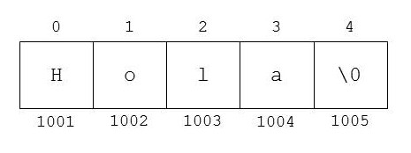
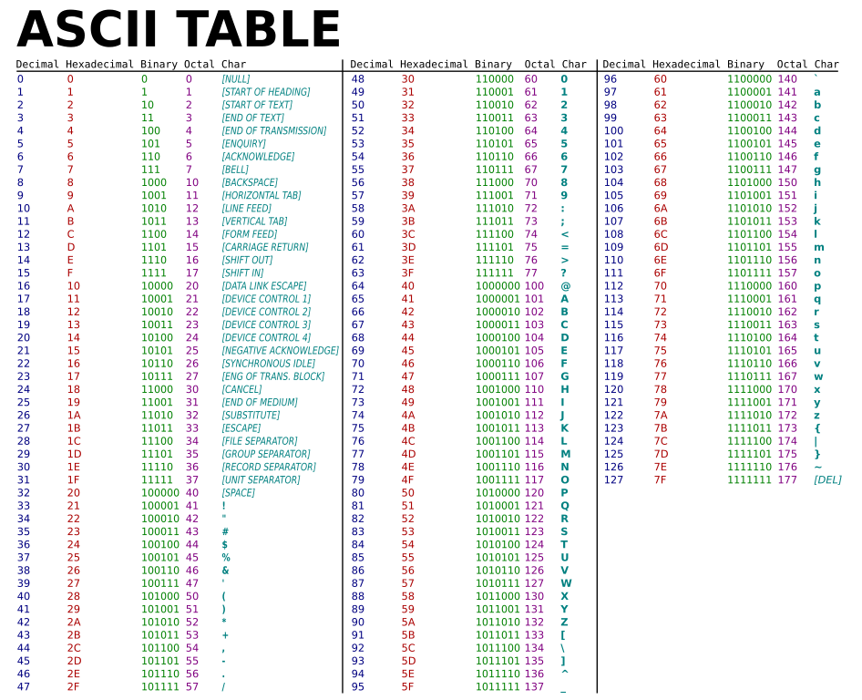

# Unit 2 - Strings

Most programs have to deal with text data. We need to manipulate strings when displaying a message on the screen or reading the name of a client entered from the keyboard, for example.

The C++ language provides two ways to work with text strings:

* C-style arrays of characters

* C++ `string` class

In this unit we will first review the C-style arrays of characters, and then focus on how to work with the `string` class in C++.

The `string` class makes working with text much easier, so it will be our preferred option in Programming 2. The only circumstance in which we will necessarily need to use C-style arrays will be when dealing with binary files. We will explain the reason for this in the Unit 3.

## Arrays of characters in C

### Declaration and initialization

Arrays of characters are native to the C language but can also be used in C++.

Text in C is represented by arrays of characters \(that is, of type `char`\) ending in the null character \(`'\0'`\). Like all arrays, they have a fixed size that is established at compilation time it and it can no longer vary throughout the execution of the program.

Example:

```
char cad[10];
```

This code declares an array of characters of 10 elements called `cad`. Since it is required to reserve a space to enter the null end-of-string character, the `cad` variable in the previous example could store a maximum of 9 effective characters.

The C/C++ language allows us to initialize character arrays using text between double quotes \(`""`\).

Example:

```cpp
char cad1[6] = "hello";
char cad2[] = "hello";
```

The two previous instructions are equivalent. In the first case, we assign the size `6` to `cad1` in order to store the five characters of `"hello"` together with the null character. In the second case with `cad2`, it can be seen that it is not necessary to indicate the size of the array when we make a declaration with initialization: the compiler will assign the array the exact size with which it is initialized \(in this case, `6`\).

Another important detail shown in this example is that it is not required to explicitly set the null character at the end of a constant string when it is declared with double quotes. The compiler automatically adds the `'\0'` at the end of the array when initialized.

For example, here you can see the memory contents of an array of characters containing `"Hola"`:



The upper numbering \(from 0 to 4\) indicates the index that would occupy each of the characters in the array. The lower numbering \(from 1001 to 1005\) represents the memory address in which each character would be stored. In this example, simplified fictitious memory addresses were used \(actually a valid address would look something like this: `0x7ffef832d670`\). The point is to see that each element of an array is stored in consecutive memory positions, which always happens whatever its type.

Another way to initialize a string is character by character.

Example:


```cpp
char cad1[5] = {'h','e','l','l','o','\0'};
char cad2[] = {'h','e','l','l','o','\0'};
```

This initialization would be equivalent to that of the previous example. In this case, it would be necessary to explicitly enter the `'\0'` character at the end of the array. If we declare the following...

```cpp
char cad[]={'h','e','l','l','o'};
```

... then we would be declaring an array of five characters containing `'h'`,`'e'`,`'l'`,`'l'` and `'o'`, but it would not be considered a "well-formed" array of characters, since it would not end with the null character. Therefore, we could not correctly use the functions provided by the C and C++ language to handle character arrays \(as we will detail below in this unit\).

As it also happens with arrays of other types, it is not necessary to use all the space reserved for the array of characters.

Example:

```cpp
char cad[100] = "Hello";
```

Here we would be allocating `100` memory positions, although we would only be occupying 6 at this time \(5 letters plus the null character\). The remaining 94 positions would be reserved but not initialized.

The empty string is represented by double quotes without any space in between:


```cpp
char emptyCharArray[] = "";
```

The array `emptyCharArray` would be of size 1, as it only stores the character `'\0'`.

### Input and output

#### Output with `cout`

We can use `cout` to show arrays of characters on the screen as with any other simple type \(`int`, `float`, etc.\).

Example:

```cpp
char cad[] = "Hello everybody!";
cout << cad;
```

This code would display `Hello everybody!`.

#### Reading with `cin >>`

An array can be read by keyboard with `cin` and the input operator `>>`  in a similar way than other simple types, but with some differences:

* Blank spaces before the first valid character are ignored. For example, if the user writes `"   hello"`, with three blank spaces in front, `cin` will ignore them and store characters starting from  `h`
* After reading a valid character, the program stops reading when the first _blank_ is found \(blank space, tabulator or end of line\). This blank is left in the keyboard buffer for the next reading

Example:

```cpp
char cad[20];
cin >> cad;
```

This program would wait for the user to enter the array by keyboard.

#### Reading with `cin` and `getline`

Reading with `cin` and `>>` can generate two problems:

* Problem 1: What happens if the array has blank spaces? If, for example, the user typed `hello everybody`, the previous program would only read `hello` since a blank space is found
* Problem 2: The `>>` operator does not limit the number of characters that are read. Therefore, what happens if the typed text does not fit in the array? Here we can have a serious problem, because we will be trying to write something in memory positions that are outside the array. In the previous example, if the user wrote `supercalifragilisticoespialidoso` there would be a memory error after exceeding the size of the array.

One way to solve these two problems is to use the `getline` function, which can read arrays with blanks and also control the maximum number of characters that are stored.

Example:

```cpp
const int kSIZE = 10;
char cad[kSIZE];
cin.getline(cad,kSIZE);
```

In this example, `getline` reads at most `kSIZE-1` characters or until it reaches the end of the line. The `'\n'` from the end of line is read, but is not stored into `cad`. The `getline` function automatically adds `'\0'` to the end of the contents that were read. For that reason, it only reads as a maximum `kSIZE-1` characters, leaving a memory position for the null character.

If the user enters `hello everybody`, the program will store into `cad` the array `hello eve` \(blank spaces are counted like any other character\).

This function also has a problem. What happens if the user enters more characters than the array size? In this case, the remaining characters will be left in the buffer, causing a failure in the next reading.

Example:

```cpp
char cad1[10];
char cad2[10];

cin.getline(cad1,10);
cout << "Array 1: " << cad1 << endl;
cin.getline(cad2,10);
cout << "Array 2: " << cad2 << endl;
```

In this program, if the user enters `hello everybody` the program would output:

```
Array 1: hello eve
Array 2:
```

#### Problems using `>>` and `getline`

We have seen two ways to read the keyboard: using the `>>` operator and with `getline`. When these two operators are combined, unexpected results may be given.

Example:

```cpp
int num;
char cad[1000];

cout << "Write a number: ";
cin >> num;
cout << "The number is " << num << endl;

cout << "Write an array of characters: " ;
cin.getline(cad,1000);
cout << "The read array is: " << cad << endl;
```

In this example, if the user types `10` after the program shows `Write a number:` the output would be as follows: 

```
Write a number: 10
The number is 10
Write an array of characters: The read array is:
```

As we can see, the user is not asked for the array. Why does this happen?

In the previous code, first an `int` is read by `>>`, and then the program reads an array with `getline`. When `10` is read with the `>>` operator, the program stops reading when it finds the first blank space \(the end of line in this case when the _enter_ key is pressed after typing `10`\), leaving that line break in the buffer. Then, when `getline` is executed, the first character that appears in the buffer is the line break `'\n'`, therefore the program finishes reading and stores an empty array in the variable `cad`.

One solution to solve this problem is to extract the `'\n'` from the keyboard buffer before the next reading. We can do this with the `ignore` method as follows:

```cpp
...
cin >> num;
cin.ignore(); // Also works with cin.get();
...
```

Here, `cin.ignore()` pulls a character from the keyboard buffer and ignores it.

### Functions of the library `string.h`

The standard library of C `string.h` offers a series of functions to work with arrays of characters. To use these functions you have to import that library using the following instruction:

```cpp
#include <string.h> // Also works with #include <cstring>
```

Among the most important functions provided by this  library we can find `strlen`, `strcmp` and `strcpy`.

#### `strlen`

This function returns an `int` with the number of characters contained in the array (ignoring the null character `'\0'`).

Example:

```cpp
char cad[20] = "bye";
cout << strlen(cad);
```

This code would print `3` \(instead of `20`, which will be the array size, or `4`, that would be the number of initialized positions taking into account the null character\).

#### `strcmp`

This function compares two arrays in lexicographical order, that is, the order that is given in a dictionary:

* The letter 'a' is smaller than 'b'
* The array "adeu" is smaller than "adios", since it would appear first in a dictionary
* Lowercase letters are greater than their corresponding uppercase letters \('a' &gt; 'A'\)
* Letters are greater than numbers \('A' &gt; '1'\)

The last two points from the previous list are not obvious. This behavior is given by the ASCII code of each character. The ASCII code is a numerical representation that each character has in the computer's memory.

Below is the ASCII code table of the first 128 characters:



The ASCII code of the character '1' is 49, while the code of the letter 'A' is 65 and that of the letter 'a' is 97. Therefore, 'a' &gt; 'A' &gt; '1'.

The function `strcmp` returns `-1` if the first array is smaller than the second, `0` if they are the same and `1` if the second array is greater. In some g++ versions, a negative value instead of `-1` or a positive value instead of `1` is returned. This number is the difference in the ASCII table between the first different characters from both arrays.

Example:

```cpp
char cad1[] = "adios";
char cad2[] = "adeu";

cout << strcmp(cad1,cad2) << endl;
cout << strcmp(cad2,cad1) << endl;
cout << strcmp(cad1,cad1) << endl;
```

This code would show:

```
1
-1
0
```

Try to run it on your computer, maybe the output you get is different.

Therefore,  we could use `strcmp` to check that two arrays of characters are equal:

```cpp
char cad1[1000];
char cad2[1000];

cout << "Enter array 1: ";
cin >> cad1;
cout << "Enter array 2: ";
cin >> cad2;

if(strcmp(cad1,cad2)==0)
{
    cout << "Arrays are equal" << endl;
}
else
{
    cout << "Arrays are different" << endl;
}
```

A more compact way of expressing `strcmp(cad1,cad2)==0` is `!strcmp(cad1,cad2)`.

#### `strcpy`

This function allows us to copy one array of characters into another:

```cpp
char cad[10];
strcpy(cad,"hello");
```

Character arrays in C, as any other array, can not be assigned directly. The following code would yield a compilation error:

```cpp
char cad[10];
cad = "hello";
```

This code would also give a compilation error:

```cpp
char cad1[10] = "hello";
char cad2[10];
cad2 = cad1;
```

Since these are arrays, you should copy element by element \(character by character\) from one array to the other one. The `strcpy` function does this process for us.

An important detail is that the target array must have enough size to store the source array. 

Example:


```cpp
char cad[10];
strcpy(cad,"Today is a fantastic day to go for a walk");
```

This code would access to non-reserved memory zones and a segmentation fault would be given when trying to copy an array of larger size than the target variable allows. Also, always keep in mind that there must also be enough space in the target array to store the `'\0'`.


#### Other functions

The `strncmp` and `strncpy` functions are similar to the previous two functions, but with the difference that they only compare or copy the `n` first characters. For example:

```cpp
char cad[10];
strncpy(cad,"Hello, world",4);
cad[4] = '\0'
```

In this example, the first `4` characters of `"Hello, world"` are copied into `cad`. The null character `'\0'` should be excplicitly copied afterwards. In this example, since we copy `4` characters, they occupy positions 0,1,2 and 3 of the array `cad`. Therefore, the null caracter should be added at position `4`.

Two more examples of interesting functions that work with arrays of characters, although they do not belong to the `stdlib.h` library are `atoi` and `atof`. The first serves to convert an array of characters that represents an integer value to its equivalent `int` value. The second function is exactly the same but for converting real values. These two functions are defined in the standard library `cstdlib`, that should be included at the beginning of our code if we wanted to use them:

```cpp
#include <cstdlib>
```

Example:

```cpp
char cad1[] = "100";
int n = atoi(cad1);

char cad2[] = "10.5";
float f = atof(cad2);
```

In this code, the variable `n` would take the value `100` and `f` would be `10.5`.

## The `string` class in C++

### Declaration and initialization

The standard C++ library provides the `string` class that supports all operations on text  mentioned above as well as many other extra functionalities.

The big advantage with respect to the arrays of characters in C is that the `string` class has  dynamic size, which means that it can change throughout the execution of the program depending on the contents that we want to store. It may increase if we wanted to store a larger string or it may decrease so as not to waste memory if we wanted to store a smaller one.

The `string` class internally uses character arrays to store the data, but the handling of the memory and the location of the null character is done in a transparent manner by the class itself to simplify its usage.

In Unit 5 (object-oriented programming) we will see the concept of "class" and its difference with a simple type. In order to use the appropriate terminology, instead of "variable of type `string`" we should say "object of the class `string`", and instead of "specific functions of `string`" we should talk about "methods". However, for simplification, in the current Unit we will continue using the previous terminology and we will talk about "types", "variables" and "functions" instead of "classes", "objects" and "methods", as they will be explained in Unit 5.

To use of some of the functions mentioned in this section it is necessary to include the C++ string library:

```cpp
#include <string> // Without .h!
```

Note that for C arrays of characters we should use the library `<string.h>` instead.

Variables of type `string` are declared as any other data type: we write the type, the name given to the variable and optionally an initial value.

Example:

```cpp
string s1;
string s2 = "hello";
const string s3 = "hello";
```

This code shows an unitialized string \(`s1`\), a variable with the initial value `"hello"` \(`s2`\) and a constant with the same initial value \(`s3`\). As you can see in this example, you should not use the brackets to indicate the size of the string as it was done with the C arrays.

A `string` is passed as a parameter to a function, \(either by value or by reference\) the same way as with any simple data \(`int`,`float`, etc. \).

Example:

```cpp
#include <iostream>
#include <string>

using namespace std;

void analyzeString(string s1, string &s2)
{
    ...
}

int main()
{
    string s1 = "hello";
    string s2 = "bye";

    analyzeString(s1,s2);
}
```

In this code two variables of type `string` are declared in the main function, `s1` and `s2`. Both are passed to the `analyzeString` function, the first by value and the second by reference.

### Input and output

As it happens with the arrays of characters in C,  the contents of a `string` can be displayed with `cout`.

Example:

```cpp
string s = "Hello everybody!";
cout << s;
```

This code would print on the screen `Hello everybody!`.

To read a string from the keyboard you can use  `cin` with the operator `>>`, as it happened with the arrays of characters in C. Their behaviour in this case is the same:

* Blank spaces that are entered before the first valid character of the string are ignored
* After reading a valid character, cin stops reading when it finds the first blank \(space, tab or line break\). This blank will be left in the keyboard buffer for the next readin.

Example:

```cpp
string s;
cin >> s;
```

If the string contains blank spaces and we wanted to read them, we could also use the `getline` function, although in this case the syntax is different than the syntax for the C arrays:

```cpp
string s;
getline(cin,s);
```

The advantage of using `getline` with `string` is that the number of characters to be read is not limited and, therefore, the maximum size should not be indicated as a parameter of the function.

If we want to read until a certain character appears \(by default `getline` reads until it finds the line break `'\n'`\), we can indicate it as a parameter. For example:

```cpp
string s;
getline(cin,s,',');
```

In this example, `getline` would read characters from the keyboard until the first occurrence of the character `','`.

Keep in mind that, in case of combining keyboard readings with the `>>` operator and with `getline`, we would have the same problem that was mentioned with the C arrays.


### Functions of the `string` library

The standard library `string` contains a series of functions that facilitate handling strings.

As `string` is a class instead of a simple type, its functions \(actually the functions of a class should be called _methods_\) are invoked by putting a `.` after the variable name. As discussed above, we will see this in detail in Unit 5, when  object-oriented programming will be introduced.

Among the most important functions provided by the `string` library, we have `length`, `find`, `replace` and `erase`.

#### `length`

This function (equivalent to the method `size()`) allows us to obtain the number of characters that a string contains. Their prototype is as follows:

```cpp
unsigned int length();
unsigned int size();
```

These methods do not receive any parameter and return as a result a value of type `unsigned int`,  since the number of characters in a string can never be a negative number.

Example:

```cpp
string s = "hello";
unsigned int size = s.length(); 
// Equivalent to:
unsigned int size = s.size();
```

This example would store `5` in the variable `size`.

#### `find`

This function allows us to search for one substring inside another one. The prototype of the function is the following:

```cpp
unsigned int find(const string str, unsigned int pos = 0);
```

The first parameter is the substring that we want to search, while the second parameter indicates from what position of the string we want to start  searching \(if nothing is indicated that value will be `0` and it will start searching by the beginning of the string\). The function returns an integer value indicating the position of the string \(`0` is the first position\) where the substring was found. If the substring was not found, the function returns the constant `string::npos`.

Example:

```cpp
string a = "There is a cup in this kitchen with cups";
string b = "cup";

// Length of a
unsigned int size = a.length();

// We wearch for the first "cup" within the string  "There is a cup..."
unsigned int found = a.find(b);

if(found != string::npos)
    cout << "Found first " << b << " in the position " << found << endl;
else
    cout << "Substring " << b << " not found";

// We search for the second "cup"
found = a.find(b,found+b.length());
if(found != string::npos)
    cout << "Found second" << b << " at position " << found << endl;
else
    cout << "Substring " << b << " not found";
```

The method `find` returns the position where it finds the first occurrence of the substring. The first search \(`a.find(b)`\) starts from the beginning of the string. The second search \(`a.find(b,found+b.length())`\) begins just after the first substring appears, so it will return the second occurrence of cup. This process could be repeated using a loop if we were interested in gathering all occurrences of one  substring within another.

#### `replace`

This function allows us to replace a substring within another string. Its prototype is:

```cpp
string& replace(unsigned int pos, unsigned int size, const string str);
```

The first parameter indicates the position in the string where characters will start to be replaced. The second parameter indicates the number of characters to be replaced. Finally, the third parameter indicates the substring to be inserted as a replacement. The function directly modifies the string on which it is applied, so it is not necessary to assign the return value to another variable.


Example:

```cpp
string a = "There is a cup in this kitchen with cups";

a.replace(11,3,"bottle");
cout << a << endl;
```

The output of this example would be `There is a bottle in this kitchen with cups`.

In this example we replaced from `a` a total of `3` characters beginning at the position `11`, and then we inserted the substring `"bottle"` instead.

#### `erase`

This function allows us to delete a series of characters from a string, or erase it completely. Its prototype is the following:

```cpp
string& erase(unsigned int pos = 0, unsigned int size = npos);
```

The first parameter indicates from which position the deletion begins. The second parameter indicates how many characters are to be deleted. If no parameter is indicated, `erase` removes all  characters from the string.

Example:

```cpp
string s = "Hello everybody";
s.erase(6,5);
cout << s;
```

The output of this code would be `Hello body`.

### Operations with `string`

Arithmetic and comparison operators can be used with variables of type `string` .

To assign a string to another, just use the assignment operator `=`.

Example:

```cpp
string s1 = "Hello";
string s2;
s2 = s1;
```

Remember that this could not be done directly with character arrays in C and the `strcpy` function had to be used instead.

String concatenation \(that is, adding one string after another\) is done with the `+` operator.

Example:

```cpp
string s1 = "Hello";
string s2 = "world";
string s3 = s1 + ", " + s2 + "!";
cout << s3;
```

This code would show `Hello, world!`.

In order to compare strings, you can use the same operators than when comparing simple types: `==`, `!=`, `>`, `<`, `>=` and `<=`.

Example:

```cpp
string s1;
string s2;

cin >> s1;
cin >> s2;

if(s1 > s2)
{
    cout << "The first string is greater than the second one" << endl;
}
else if (s1 < s2)
{
    cout << "The first string is lower than the second one" << endl;
}
else if (s1 == s2)
{
    cout << "Both strings are the same" << endl;
}
```

We can access the different characters of a `string` the same way than with an array, using `[]`.

Example:

```cpp
string s = "Hello";

for (unsigned i = 0; i<s.length(); i++)
{
    cout << s[i] << endl;
}
```

This code performs a loop that shows on the screen a string character by character:

```
H
e
l
l
o
```

You can also change the value of a particular character in the `string` using this syntax.

Example:

```cpp
string s = "hello";
s[0] = 's';
s[4] = 'a';
cout << s;
```

This code replaces the first and fourth characters of the string and displays on the screen `sella`.

It is important to bear in mind here that we can only assign characters to positions in the string that already exist.

Example:

```cpp
string s = "hello";
s[5] = '!';
cout << s;
```

In this example we are trying to change the value of the character in the position `5` of the string, but this position does not exist as the variable `s` only allocated space to store the string `"hello"`, ranging from position 0 to 4.

Maybe you will get a segmentation fault, or sometimes you will get as output `hello`, as the character `!` can not be stored. 

### Conversion between `string` and numbers

We can convert an integer or float number into a `string` using the function `to_string`.

Example:

```cpp
int n = 100;
string number = to_string(n);
```

This function belongs to the C++11 version, so in order to use it in our code we should compile our program adding the parameter `std=c++11` to `g++`. For example, if our code is called `prog.cc` we should compile it with the command `g++ -std=c++11 prog.cc`.

To convert from a string to an integer or a real number, we can use the same functions than in C arrays: `atoi` and `atof`. However, bear in mind that these functions expect as input an array of characters and not a type `string`. Therefore, a  conversion must be done using the `c_str` function of the `string` class, which allows to convert a `string` to an array of characters in C. This method, when applied to a variable of type `string`, returns an array of characters with its contents.

Example:

```cpp
string s1 = "100";
int n1 = atoi(s1.c_str());

string s2 = "10.5";
float n2 = atof(s2.c_str());
```

We could also use the functions _stoi_ and _stof_ (string to integer and string to float) which receive directly C++ strings as parameters, but for this we should compile our code with `std=c++11`.

### Extracting words from a `string`

Given a text stored in a `string`, we can extract each of the words it contains \(assuming they are separated by blank spaces\) using the `stringstream` class. In order to use this class you have to import the corresponding library at the beginning of our code:


```cpp
#include <sstream>
```

Example:

```cpp
stringstream ss("Hello cruel world 1 32 2.3");
string s;

while(ss >> s)
{
    cout << "Word: " << s << endl;
}
```

In this code, for each iteration of the `while` loop, the operator `>>` reads from `ss` until it finds a blank space, storing the result in `s`. The class `stringstream` reads the input the same way than using `cin`, as both of them are streams.

## Conversion between C arrays and `string`

In order to convert a C array into a `string`, we can create a `string` variable and use the operator `=` directly.

Example:

```cpp
char cad[] = "hello";
string s = cad;
```

In order to convert a `string` into an array of characters in C, we can use the function `c_str` from the `string` class previously mentioned, along with the function `strcpy` to make the copy between arrays.

Example:

```cpp
string s = "hello";
char cad[10];
strcpy(cad,s.c_str());
```

Warning: Note that `cad` should have enough space to store all the characters from `s`.

## Comparison between arrays of characters in C and `string`

We summarize in the following table the main differences between C arrays of characters and `string`.


| arrays of characters | `string` |
| ---: | :--- |
| `char cad[kSIZE];` | `string s;` |
| `char cad[] = "hello";` | `string s = "hello";` |
|  |  |
| `strlen(cad);` | `s.length();` or `s.size();` |
| `cin.getline(cad,kSIZE);` | `getline(cin,s);` |
| `if (!strcmp(cad1,cad2)){...}` | `if (s1 == s2){...}` |
| `strcpy(cad1,cad2);` | `s1 = s2;` |
| `strcat(cad1,cad2);` | `s1 = s1 + s2;` |
|  |  |
| `strcpy(cad,s.c_str());` | `s = cad;` |
|  |  |
| They end with `\0` | They DO NOT end with `\0` |
| Constant size in memory | Dynamic size in memory |
| Variable occupied size | Occupied size = Reserved size |
|  |  |
| They are used with binary files | They SHOULD NOT be used in binary files |

-----

## Exercises

### Exercise 1

Design a function called _subString_ to extract
a substring of length _n_ starting from the position _p_ of the input string. Both the argument and the return variable must be strings.

Prototype:

```
string subString(string input, int n, int p);
```

Output example:

```cpp
string s = subString("heeeello", 2, 5);
cout << s << endl; // Prints "ll"
```

Take into account that _n+p_ could be longer than the string size.

### Exercise 2

Design a function called _eraseCharFromString_. Given a string and a character, the function must delete all the occurrences of the character in the string. 

Prototype:

```
string eraseCharFromString(string input, char c);
```

Output example:

```cpp
string s = eraseCharFromString("hello, world!",'o');
cout << s << endl; // Prints "hell, wrld!"
```

Take into account that the character may not appear in the input string.

### Exercise 3

Design a function caled _searchSubstring_ to find the first occurrence of the substring _a_ into the string _b_, returning its position or −1 if it is not found. Variables _a_ and _b_ must be strings.

Prototype:

```cpp
int searchSubString(string a, string b);
```

Output example:

```cpp
int n = searchSubString("eeel", "heeeello");
cout << n << endl; // Prints 2
```

### Exercise 4

Design a function called _encrypt_ for encrypting a string by adding a constant value _c_ to the ASCII code of each character. It must be considered that the result should be a letter.

For instance, if _n = 3_, 'a' would be encoded as 'd', 'b' as 'e', ..., 'x' as 'a', 'y' as 'b', and 'z' as 'c'.

The function should consider uppercase and lowercase letters. The non-letter characters should not be encrypted.

Prototype:

```cpp
string encrypt(string input, int n);
```

Output example:


```cpp
string s = encrypt("hola, mundo", 3);
cout << s << endl; // Prints "krod, pxqgr"
```

### Exercise 5

Design a function called _isPalindromic_ to return _true_ if the string passed as parameter is palindromic. 

Prototype:

```cpp
bool isPalindromic(string input);
```

Output example:

```cpp
bool a = isPalindromic("hola,aloh"); // a is true 
bool b = isPalindromic("hola, aloh") // b is false
```

### Exercise 6

Design a function called _createPalindromic_ for appending to a given string the same string but reversed, in such a way that the output string will be palindromic.

Prototype:

```cpp
void createPalindromic(string &s);
```

Output example:

```cpp
string s = "hola, mundo";
createPalindromic(s);
cout << s << endl; // Prints "hola, mundoodnum ,aloh"
```

